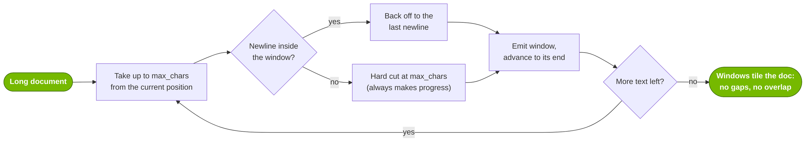
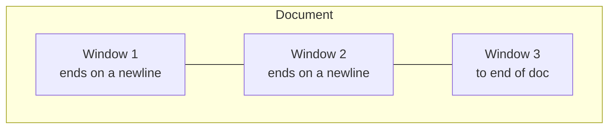
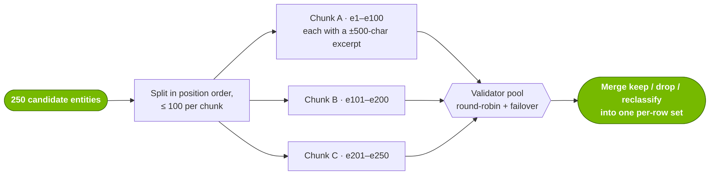
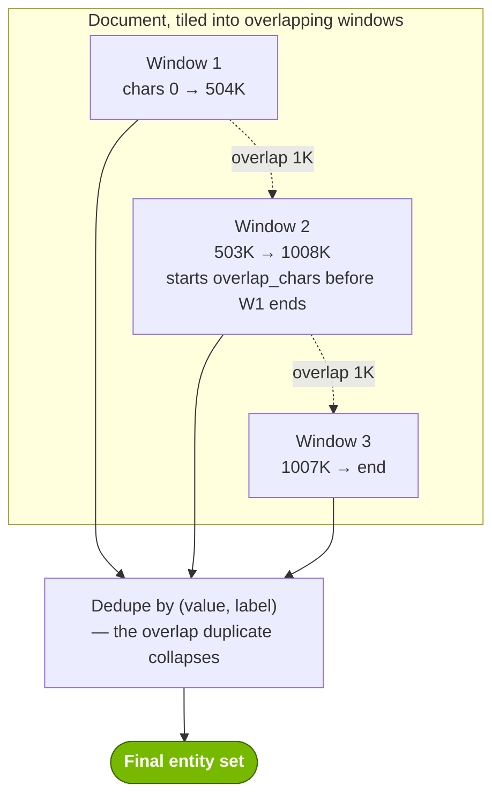
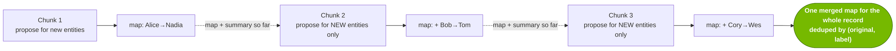
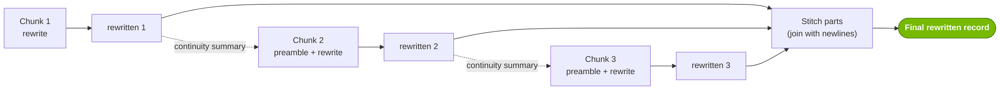

<!-- SPDX-FileCopyrightText: Copyright (c) 2025-2026 NVIDIA CORPORATION & AFFILIATES. All rights reserved. -->
<!-- SPDX-License-Identifier: Apache-2.0 -->

# Long-context handling

A single record can be larger than what one LLM call can take — either it exceeds the model's context window, or it exceeds the renderer's prompt-size cap, or it just makes a single call slow and rate-limit-prone. Anonymizer never silently truncates such inputs. Instead, every LLM-backed stage splits a large record into pieces, processes the pieces, and reassembles the result.

Different stages have different bottlenecks, so they split in different ways. This page collects all of them in one place. Each stage has a **fast path**: if a record's rendered prompt already fits under the cap, it runs as a single call that is exactly equivalent to the un-split behavior, and none of the machinery below applies.

---

## The shared primitive: boundary-aware windowing

The [Substitute](replace.md) map and [Rewrite](rewrite.md) paths tile a document into **sequential, non-overlapping** windows. Rather than cut at an arbitrary character offset, each window backs off to the last newline inside it, so a chunk boundary lands on a natural break instead of mid-line or mid-word. If a window contains no newline at all, it hard-cuts at the size limit so progress is always made.



The result is a sequence of abutting windows that reconstruct the document exactly — no character dropped, none duplicated:



Implementation: `next_window_end()` / `iter_boundary_windows()` in `src/anonymizer/engine/windowing.py`.

A floor of **4,000 characters** (`_MIN_WINDOW_CHARS`) prevents a pathological document from shrinking windows to nothing.

---

## The render cap

All stages size their windows against one ceiling: the maximum number of characters a single rendered prompt may contain. This defaults to DataDesigner's `MAX_RENDERED_LEN` (**512,000 characters**). A **safety margin** (default **8,000 characters**) is subtracted from the cap when sizing a window, leaving headroom for prompt scaffolding, entity tags, and seed JSON that get added on top of the raw text:

```
initial_window = max(4,000, cap − safety_margin) = max(4,000, 512,000 − 8,000) = 504,000
```

---

## Four strategies, by stage

The right way to split depends on what the stage is doing. Stages that *detect* things statelessly can process windows independently and just merge the results; stages that *transform* text must carry state across windows so the output stays consistent.

| Stage | Mode(s) | Splits by | Windows | Carries state across windows? |
|-------|---------|-----------|---------|-------------------------------|
| [Validation](#1-validation-split-by-entity-count) | both | entity **count** | n/a (splits a list) | no |
| [Augmentation / Latent](#2-augmentation-latent-overlapping-windows) | both / rewrite-only | character **windows** | **overlapping** | no — overlap + dedupe |
| [Substitute map](#3-substitute-map-sequential-windows-rolling-state) | replace | character **windows** | **abutting** | yes — running map + summary |
| [Rewrite generation](#4-rewrite-generation-sequential-windows-continuity) | rewrite | character **windows** | **abutting** | yes — continuity summary |

The mental model: **stateless detection → overlapping windows, just dedupe the seam; stateful transformation → abutting windows, thread a rolling summary through the seam; validation → split a list, not a window.**

---

### 1. Validation: split by entity count

The validator's bottleneck is *how many candidate entities* it must judge, not document size — so this stage splits a **list of candidates**, not the text. The full document is never sent; each entity travels with a bounded excerpt of surrounding context.



A chunk carries only its entities plus a bounded excerpt around each — never the whole document.

- **`validation_max_entities_per_call`** (default `100`) — candidates per chunk.
- **`validation_excerpt_window_chars`** (default `500`) — characters of context included before and after each chunk's spans.

Both are fields on [`Detect`](detection.md#detect-fields). Chunks are dispatched across a [validator pool](models.md#validator-pools) for load-spreading and failover. See [Chunked validation](detection.md#chunked-validation) for the full treatment, including what happens when a row can't be validated.

---

### 2. Augmentation / Latent: overlapping windows

[Augmentation](detection.md) (finding entities the NER model missed) and **latent-entity detection** (rewrite mode only) both scan the text for things to flag. Each window is processed independently — the only thing connecting adjacent windows is **overlap**, which guarantees an entity sitting on a boundary lands fully inside at least one window. Results are then deduplicated.



Overlap is what makes independent windows safe. An entity that straddles a boundary — say `...the patient Maria Garcia was admitted...`, split by Window 1 — still appears **whole** inside Window 2, because Window 2 starts `overlap_chars` before Window 1 ends. The duplicate it produces is removed by the dedupe step.

If a particular window is tag-dense and still renders over the cap, **only that window** shrinks (proportionally to the overage) and retries; the others stay full size.

- **`detection_window_max_render_chars`** (default `512,000`) — the render cap.
- **`detection_window_safety_margin_chars`** (default `8,000`) — headroom subtracted when sizing windows.
- **`detection_window_overlap_chars`** (default `1,000`) — overlap between adjacent windows.

All three are fields on [`Detect`](detection.md#detect-fields) and apply to both augmentation and latent detection.

!!! note "Cross-window inference limit"
    Because latent detection works one window at a time, a latent fact that is *only* deducible by combining details from distant parts of a very long document can be missed. Overlap mitigates boundary cases, not arbitrarily long-range inference. Implementation: `src/anonymizer/engine/detection/chunked_latent.py`.

---

### 3. Substitute map: sequential windows + rolling state

[Substitute](replace.md) must map each entity to a *consistent* synthetic value across the whole record — "Alice" → "Nadia" everywhere. Windows therefore can **not** be independent. The map path uses abutting [boundary windows](#the-shared-primitive-boundary-aware-windowing) and threads two pieces of state through the seams: the **accumulated map so far** and a **rolling summary**.



Each chunk proposes replacements **only** for entities not already in the map, and the accumulated map plus a rolling summary travel forward through every seam — so `Alice` maps to `Nadia` everywhere.

The rolling summary is capped at **`summary_max_chars`** (default **2,000**) and is meant to hold "only facts useful for keeping entity replacements consistent."

Implementation: `generate_replacement_map_row()` in `src/anonymizer/engine/replace/chunked_replace.py`.

---

### 4. Rewrite generation: sequential windows + continuity

[Rewrite](rewrite.md) produces new prose, so it must keep the *narrative* coherent across chunk seams — not just entity names. Like Substitute, it uses abutting boundary windows, but instead of merging a map it concatenates rewritten text, and the carried state is a **continuity preamble** built from a rolling narrative summary.



The continuity preamble — built from a rolling narrative summary — is prepended to every chunk after the first, so pseudonyms and narrative state (e.g. `Alice→Nadia`, "morning in NYC") stay consistent across the seams. The rewritten parts are then stitched in order.

The same render cap (512,000), safety margin (8,000), and `summary_max_chars` (2,000) apply. The replacement map built in [step 3](#3-substitute-map-sequential-windows-rolling-state) is also passed into **every** chunk so "replace"-classified entities stay consistent across the whole rewrite — see [How the replacement map is used in rewrite mode](rewrite.md).

Implementation: `generate_rewrite_row()` in `src/anonymizer/engine/rewrite/chunked_rewrite.py`.

---

## What's tunable

| Knob | Default | Affects | Where |
|------|---------|---------|-------|
| `validation_max_entities_per_call` | `100` | Validation | [`Detect`](detection.md#detect-fields) |
| `validation_excerpt_window_chars` | `500` | Validation | [`Detect`](detection.md#detect-fields) |
| `detection_window_max_render_chars` | `512,000` | Augmentation, Latent, Substitute map, Rewrite generation | [`Detect`](detection.md#detect-fields) |
| `detection_window_safety_margin_chars` | `8,000` | Augmentation, Latent, Substitute map, Rewrite generation | [`Detect`](detection.md#detect-fields) |
| `detection_window_overlap_chars` | `1,000` | Augmentation, Latent | [`Detect`](detection.md#detect-fields) |

Setting `detection_window_max_render_chars` (and `detection_window_safety_margin_chars`) on your `Detect` config resizes **all four** windowed stages — including the Substitute-map and Rewrite-generation paths, which derive their per-call window size from these values. Lowering the cap is the main lever for entity-dense documents: it puts fewer entities (Substitute map) and less text (Rewrite) into each LLM call, which avoids per-request timeouts. `detection_window_overlap_chars` applies only to the overlapping stages (augmentation, latent); the Substitute-map and Rewrite paths use abutting windows. The 2,000-character rolling-summary cap and the 4,000-character window floor remain internal constants.

---

## Source map

| Concern | File |
|---------|------|
| Boundary-aware windowing primitive | `src/anonymizer/engine/windowing.py` |
| Validation chunking | `src/anonymizer/engine/detection/chunked_validation.py` |
| Augmentation windowing | `src/anonymizer/engine/detection/chunked_augmentation.py` |
| Latent windowing | `src/anonymizer/engine/detection/chunked_latent.py` |
| Substitute map chunking | `src/anonymizer/engine/replace/chunked_replace.py` |
| Rewrite generation chunking | `src/anonymizer/engine/rewrite/chunked_rewrite.py` |
| Window-config defaults | `src/anonymizer/config/anonymizer_config.py` (`Detect`) |
