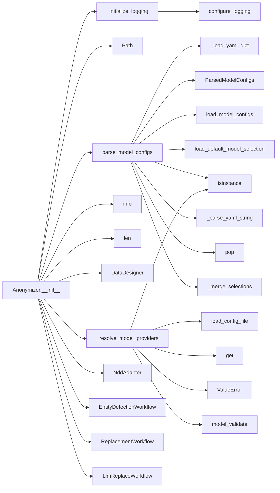
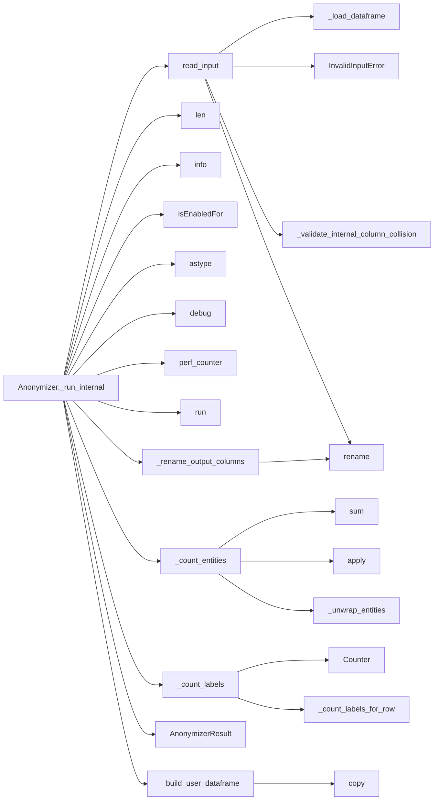

# Architecture

PLACEHOLDER: 2-3 sentences describing what Anonymizer does, where NDD fits, and what DataDesigner provides.

## Initialization

## Data Flow

## Entrypoints

PLACEHOLDER: Description of public API entry points.

## CI and Developer Workflow

PLACEHOLDER: Description of the CI pipeline and developer workflow.
