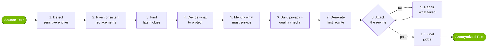

<!-- SPDX-FileCopyrightText: Copyright (c) 2025-2026 NVIDIA CORPORATION & AFFILIATES. All rights reserved. -->
<!-- SPDX-License-Identifier: Apache-2.0 -->

# Introducing NeMo Anonymizer
*Text anonymization for the reasoning era*

{ loading=lazy }

<!-- more -->

Picture this: you ship a year of customer support transcripts to a vendor for model fine-tuning. Names, emails, phone numbers, account IDs — every identifier you can think of — stripped. A week later, the vendor's eval team flags a transcript and identifies the account: the customer who escalated repeatedly after a regional outage last spring, then quietly churned a month later.

You didn't leak a name.

> You leaked a *fingerprint*.

The escalation pattern, the region, the churn timing — combined, they point to one account.

This is the privacy problem that text anonymization actually has to solve in 2026, and it's the problem **NeMo Anonymizer** — **Anonymizer**, for short — is built for.

---

## The Old Playbook Has a Ceiling

For three decades, text anonymization was a relatively bounded problem: find names, addresses, dates, phones, IDs, and a handful of other recognizable identifiers — then redact, hash, or replace them. The toolkit was a list of entity types and a regex library, occasionally with a named entity recognition (NER) model bolted on top.

It worked — but the limits had been known for a long time, and one of them just stopped being theoretical.

**Inference got cheap, and linkage got easy.** Modern LLMs are unsettlingly good at reading between the lines: even after the obvious identifiers are gone, seemingly harmless details — a job title, a regional reference, a treatment timeline, a family structure — can still narrow a person down. Recent work has shown that LLMs can recover sensitive personal attributes from "clean" text just by reasoning over context.[^staab2023] [^ma2025] And agents now have infinite tools at their beck and call — web search, public records, social graphs, breach corpora — so cross-referencing those inferred attributes against the outside world is no longer a research project. It's a few tool calls.

**Quasi-identifiers do the heavy lifting.** Long before LLMs, Golle's foundational study[^golle2006] showed that **gender, birth date, and 5-digit ZIP code uniquely identify between 63% and 87% of the U.S. population**. No name required. The combinations matter more than any single field.

The lesson is uncomfortable but simple:

> Anonymization is not an entity-masking problem. It's a contextual reasoning problem.

If your adversary can reason, your anonymizer must too.

---

## What Is Anonymizer?

Anonymizer is a **library for structured text anonymization**. Every input first passes through **hybrid entity detection**, then enters one of two transformation flows: **Replace** or **Rewrite**. Across both flows, the goal is the same — **transform the minimal set of details required to break sensitive inference, while preserving as much useful meaning as possible.** Pick the flow that matches your risk tolerance.

### Entity detection

Before either flow runs, Anonymizer detects sensitive entities using a **hybrid pipeline**: classical/model-based NER for the obvious explicit identifiers, plus LLM contextual for the long tail of implicit references and domain-specific risks the NER model has never seen. Structured detection is fast and consistent; LLM detection is flexible and contextual.

This step runs before Replace and Rewrite — both pipelines start here.

### Replace: detected-entity transformations

Replace operates on detected entities — the specific text *spans* the system flags as sensitive. You pick one of four treatments on your `AnonymizerConfig`, and it applies uniformly to every detected entity across every record in the run:

| Strategy | What it does | When to use it |
|---|---|---|
| **Substitute** | Swaps each entity for a realistic alternative | You need realistic-looking text for downstream use |
| **Redact** | Replaces each entity with a tag or mask | You just need the sensitive content gone |
| **Annotate** | Wraps each entity with its label | You're auditing detections or labeling training data |
| **Hash** | Maps each entity to a stable hashed value | You need stable joins across records |

When Substitute is selected, replacements need two properties. Each one is **realistic on its own** — a fake name reads like a real name, a fake email like a real email. And the set is **internally consistent** — names match email local-parts, cities match cultural cues, organizations align with job titles, demographics don't contradict. Without that second property, you'd get records like *"Maya Chen (j.smith@acme.com), based in Lagos, recently visited the Brandenburg Gate during her trip to Tokyo."* — useless for analytics, instantly recognizable as fake.

If span-level transformation with a coordinated map meets your risk tolerance, this is the path — fast, deterministic, and coherent across entities.

### Rewrite: full contextual anonymization

Rewrite is the heavier hammer. Instead of only swapping out detected spans, it reasons over the *whole text* — explicit identifiers, quasi-identifiers, latent clues, your privacy goal, and the meaning that needs to survive — then generates and *evaluates* an anonymized version end-to-end.

**Deciding what to protect (step 4) is goal-aware.** Anonymizer's *sensitivity disposition* depends on your privacy goal: a text for public release demands more aggressive generalization than one used internally for controlled analytics. The same input yields different rewrites.

**The repair loop (step 9) is feedback-driven, not random.** When a privacy check fails under attack, the failure ships with an adversarial explanation naming *which clues* still leak the protected fact — and that's what the repair stage acts on, not a "try again" signal.

**The final judge (step 10) is a holistic check, not another attacker.** Once the privacy and quality checks pass their thresholds, an LLM-as-Judge does an end-to-end review for fluency, factual coherence, and obvious leaks the attack questions didn't cover.

---

## The Innovation

### 1. Latent entities are the real adversary

A **latent entity** is an identifying factor that may not be explicitly named, but can still be inferred from surrounding clues. Latent entities exist in the original text. They also get *created* by naive replacement.

The canonical example: you replace `"Seattle"` with `"a generic city"`. Done? Not even close. The text might still mention the Space Needle, ferries to Bainbridge, a Mariners game, Puget Sound, and persistent rainy weather. Any one of those alone is harmless. Together, they reconstruct `Seattle` with high confidence.

Anonymizer doesn't stop at the string that was replaced. It asks: **does the surrounding text or a later reference still reconstruct the protected fact?** If yes, it's not actually anonymized — it just looks like it is.

### 2. Privacy is contextual, not categorical

A job role can be harmless in a generic record but uniquely identifying when paired with a rare specialty and a narrow timeline. A drug name is benign in a research paper but identifying in a patient note. **What's sensitive depends on the surrounding text and your privacy goal — not on a fixed list of "PII categories."** Anonymizer treats privacy as contextual, which is why it works across domains — clinical, legal, financial, conversational, technical, biographical, and more — without per-domain retraining.

### 3. Privacy without utility is privacy theater

Most adversarial anonymization frameworks frame the problem as: *generate a rewrite, attack it, repeat until protected attributes can no longer be inferred.*[^pilan2024] [^frikha2025] [^staab2025] [^kim2025] Necessary, but not sufficient — if your "anonymized" text is too sanitized to be useful downstream, you simply replaced one problem with another.

Anonymizer extracts the **meaning units** that should survive (events, relationships, chronology, conclusions, and domain-specific facts), turns them into a **Quality QA** harness, and turns privacy risks into a **Privacy QA** harness. Both run against the anonymized output, and the privacy harness drives iterative refinement.

---

## What's Next

Text anonymization in the LLM era looks less like find-and-replace and more like a privacy reasoning system: detect the obvious, surface the latent, plan a coherent transformation, attack the result, repair what fails, and validate end-to-end. Anonymizer ships this as a single pipeline you can point at clinical, legal, financial, conversational, biographical, and other text — Replace when span-level transformation with consistent replacements is enough, Rewrite when it isn't.

Tighter utility-aware repair, broader multilingual coverage, and evaluation against benchmarks like TAB[^tab2022], NAP²[^nap2-2024], SynthPAI[^synthpai2024], and RAT-Bench[^ratbench2026] are all coming soon. The architecture already encodes the innovation at the heart of the library:

> Protecting text in the LLM era requires a system that reasons. Not a system that masks.

---

## Try It

Point Anonymizer at a sample of your own data and start with `preview()`. The [README](https://github.com/NVIDIA-NeMo/Anonymizer#readme) has the quick-start. Prefer to drive it from your favorite coding agent? Install the [Anonymizer skill](https://github.com/NVIDIA-NeMo/Anonymizer/blob/main/skills/anonymizer/SKILL.md) (`npx skills add NVIDIA-NeMo/Anonymizer`) and design your workflow with the help of your favorite agent.

Help us push it further 🚀

## Resources

- [NeMo Anonymizer on GitHub](https://github.com/NVIDIA-NeMo/Anonymizer)
- [Anonymizer Documentation](https://nvidia-nemo.github.io/Anonymizer/)
- [Replace](../../concepts/replace.md) and [Rewrite](../../concepts/rewrite.md) concept docs
- [Tutorials](../../tutorials/index.md) — your first anonymization, inspecting detected entities, choosing a replacement strategy, and rewriting biographies and legal documents

[^staab2023]: Staab et al., 2023. [*Beyond Memorization: Violating Privacy via Inference with Large Language Models*](https://arxiv.org/abs/2310.07298). ICLR 2024.
[^ma2025]: Ma et al., 2025. [*SoK: Semantic Privacy in Large Language Models*](https://arxiv.org/abs/2506.23603).
[^golle2006]: Golle, 2006. [*Revisiting the Uniqueness of Simple Demographics in the US Population*](https://crypto.stanford.edu/~pgolle/papers/census.html). WPES 2006.
[^tab2022]: Pilán et al., 2022. [*The Text Anonymization Benchmark (TAB): A Dedicated Corpus and Evaluation Framework for Text Anonymization*](https://aclanthology.org/2022.cl-4.19/). Computational Linguistics 48(4).
[^nap2-2024]: Huang et al., 2024. [*NAP²: A Benchmark for Naturalness and Privacy-Preserving Text Rewriting by Learning from Human*](https://arxiv.org/abs/2406.03749). EMNLP 2025 Findings.
[^synthpai2024]: Yukhymenko et al., 2024. [*A Synthetic Dataset for Personal Attribute Inference*](https://arxiv.org/abs/2406.07217). NeurIPS 2024.
[^ratbench2026]: Krco et al., 2026. [*RAT-Bench: A Comprehensive Benchmark for Text Anonymization*](https://arxiv.org/abs/2602.12806).
[^pilan2024]: Pilán et al., 2024. [*Truthful Text Sanitization Guided by Inference Attacks*](https://arxiv.org/abs/2412.12928). Applied Soft Computing 2025.
[^frikha2025]: Frikha et al., 2025. [*IncogniText: Privacy-enhancing Conditional Text Anonymization via LLM-based Private Attribute Randomization*](https://arxiv.org/abs/2407.02956). IJCNLP-AACL 2025.
[^staab2025]: Staab et al., 2025. [*Language Models are Advanced Anonymizers*](https://arxiv.org/abs/2402.13846). ICLR 2025.
[^kim2025]: Kim et al., 2025. [*Self-Refining Language Model Anonymizers via Adversarial Distillation (SEAL)*](https://arxiv.org/abs/2506.01420). NeurIPS 2025.
