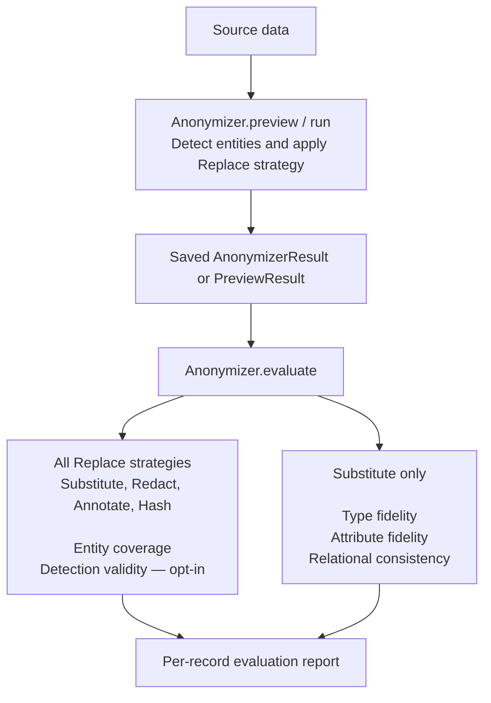
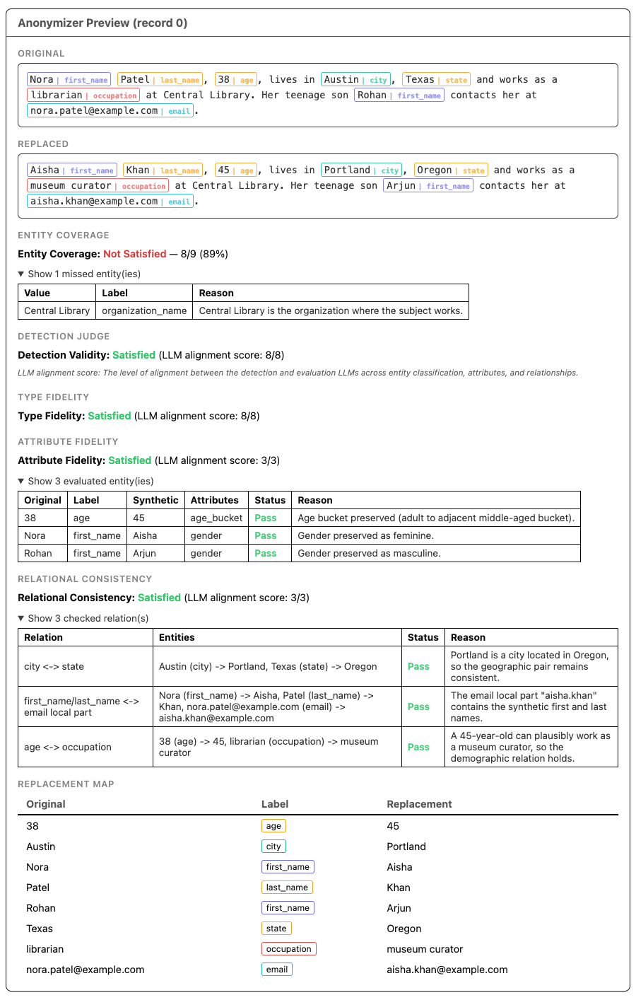

---
date:
  created: 2026-07-28
readtime: 10
authors:
  - memadi-nv
---

# **After Anonymization — Part I: Evaluating Replace Mode**

<!-- SPDX-FileCopyrightText: Copyright (c) 2025-2026 NVIDIA CORPORATION & AFFILIATES. All rights reserved. -->
<!-- SPDX-License-Identifier: Apache-2.0 -->

You need to share a dataset of customer biographies for model development without exposing personal information, so you run it through NeMo Anonymizer's Replace mode. At first glance, the result looks right: the obvious identifiers have changed, the text reads naturally, and nothing appears broken.

Look closer, though. One sensitive value was never detected. The synthetic name no longer matches the email address. The city and postal code belong to different regions. An age of 38 became 8, quietly turning an adult into a child. The record looks anonymized, but it may still expose private information or distort the original meaning.

`Anonymizer.evaluate()` provides a second pass over these results. It checks whether detection covered the sensitive values in the original text and, for Substitute mode, whether the generated replacements preserve their types, important attributes, and relationships.

This is Part 1 of a two-part series on evaluation in Anonymizer. It explores how Replace-mode evaluation surfaces problems that a quick review can miss, what each score means, and how to interpret the results. Part 2 will cover Rewrite mode, where the evaluation questions are different.

<!-- more -->

<div style="text-align: center;" markdown>

{ loading=lazy }

</div>

---

## Anonymization and Evaluation as Separate Steps

Anonymizer deliberately separates anonymization from evaluation.

This separation has two practical benefits:

- **Evaluation is optional.** Large batches can skip evaluation for faster results and lower compute cost. For audits or iteration before a full run, evaluate a smaller `preview()` result instead. `evaluate()` scores every row in the result.
- **The result is reusable.** The same original, unevaluated output can be evaluated with different judge models or at a different time without re-running entity detection and replacement.

**Important:** To evaluate in a later session, save the complete `AnonymizerResult` or `PreviewResult` using Python's `pickle` module—not just its `dataframe`.

```python
import pickle

from anonymizer import Anonymizer, AnonymizerConfig, AnonymizerInput, Substitute

anonymizer = Anonymizer()

result = anonymizer.run(
    config=AnonymizerConfig(replace=Substitute()),
    data=AnonymizerInput(source="records.csv", text_column="text"),
)

# To evaluate immediately after anonymization, use:
# evaluated = anonymizer.evaluate(result)

# To evaluate in a later session, save the complete result.
with open("anonymizer-result.pkl", "wb") as f:
    pickle.dump(result, f)

# In the later session, reload the complete result before evaluating it.
with open("anonymizer-result.pkl", "rb") as f:
    saved_result = pickle.load(f)

evaluated = anonymizer.evaluate(saved_result)

# Select the evaluation output columns you want to inspect.
output_columns = ["entity_coverage", "missed_entities"]
scores = evaluated.dataframe[output_columns]
```

Because the anonymization mode and strategy travel with the result, `evaluate()` already knows whether to run the Substitute-specific judges. The user does not restate the strategy.

Replace the names in `output_columns` with any evaluation columns available for the strategy and evaluation options you used.

---

## Inside the Anonymizer Replace Evaluation Report

The judges that run depend on which Replace strategy was used.

**Entity coverage** runs for every strategy. It measures entity detection recall by independently identifying in-scope candidate values in the original text and checking whether Anonymizer detected them.

**Detection validity** is optional and shared across all strategies. It checks the precision side: were the entities Anonymizer *did* detect actually valid in context?

**Three substitution-quality judges** run only for Substitute. They check whether each generated replacement preserves the original entity's type, attributes, and relationships—properties that do not apply to Redact, Annotate, or Hash.



---

### Entity Coverage: Were All In-Scope Entities Detected?

Entity coverage measures how many unique, in-scope candidate values identified by the judge were also detected by Anonymizer.

An independent LLM judge extracts candidate values from the original text. Postprocessing removes out-of-scope, non-literal, and duplicate candidates, then compares the remaining values with Anonymizer's detected entities. Unmatched candidates appear in `missed_entities`.

The score is computed per record:

```
entity_coverage = n_covered / n_candidates
```

A score of `1.0` means no judge candidates were missed, or the judge found no candidates. A lower score means the judge found candidate values not covered by Anonymizer's detected entities. Entity coverage measures entity detection recall, not final replacement quality or leakage in the replaced text.

A score below `1.0` is a review signal, not definitive evidence of a privacy failure. Perform a human review of the `missed_entities` entries in context: judge candidates can be ambiguous, and whether broad values require protection depends on your privacy policy. For example, `"teenager"` conveys an age range but may be abstract enough to retain in some contexts.

<div class="output-columns-table" markdown>

| Output column | Meaning |
|---|---|
| `entity_coverage` | Float in `[0.0, 1.0]`, or `None` if the judge was unavailable |
| `missed_entities` | List of `{value, label, reasoning}` for each entity the judge found that Anonymizer missed |

</div>

Entity coverage always runs. No extra configuration is needed. The judge respects the entity scope configured for the run — if `entity_labels` was set, only entities of those types are considered in scope. If a `data_summary` was provided, it is passed to the judge to help interpret domain-specific values in context.

---

### Detection Validity: Were the Detected Entities Valid in Context?

Detection validity is the precision-side complement to entity coverage. It checks whether each detected `(value, label)` pair is valid in the context of the original text.

It surfaces:

- **False positives** — ordinary words or boilerplate treated as sensitive.
- **Wrong labels** — a real entity assigned to a clearly incompatible category.
- **Wrong boundaries** — a partial span or one that absorbs surrounding text it should not.
- **Contextual mismatches** — a token that could be an entity elsewhere but isn't one in this sentence. The word `"Apple"` in a grocery note is different from `"Apple"` in an employment record.

***Note:*** Detection-validity judgments are particularly sensitive to entity label names and wording. Ambiguous, overlapping, or domain-specific labels can change how the judge interprets the same detected value, so review flagged wrong-label cases against your configured taxonomy.

<div class="output-columns-table" markdown>

| Output column | Meaning |
|---|---|
| `detection_valid` | `True` — all checked entities passed; `False` — one or more failed; `None` — judge unavailable |
| `detection_invalid_entities` | Flagged `{value, label, reasoning}` pairs |

</div>

Detection validity is **opt-in** and is intended primarily for model and threshold evaluation. What counts as an acceptable sensitive-entity detection can depend on the dataset, privacy policy, and desired label granularity. To enable it:

```python
from anonymizer import EvaluateConfig

evaluated = anonymizer.evaluate(result, config=EvaluateConfig(compute_detection_validity=True))
```

---

### Substitute-Only Scores

The three judges below only run when the Replace strategy is `Substitute`, because Substitute generates synthetic entity values. Redact, Annotate, and Hash transform detected spans but do not generate synthetic replacements to which these checks apply.

#### Type Fidelity: Did Each Replacement Preserve Its Type and Format?

A phone number should stay phone-shaped. An email should stay email-shaped. A city should not become a country. Type fidelity works at the individual replacement level and anchors its decision in the original value — not whether the synthetic value is merely plausible in isolation.

<div class="output-columns-table" markdown>

| Output column | Meaning |
|---|---|
| `type_fidelity_valid` | Whether every replacement has compatible type and format |
| `type_fidelity_invalid_replacements` | Original, synthetic, label, and reasoning for each failure |

</div>

#### Attribute Fidelity: Were Salient Attributes Preserved?

An age of `38` and an age of `8` are both valid ages. But replacing one with the other changes an adult into a child, which makes surrounding pronouns and context incoherent. Attribute fidelity currently focuses on clearly implied gender for names and age buckets for ages and dates of birth. Adjacent or ambiguous cases receive the benefit of the doubt — the judge catches clear semantic drift, not uncertain demographic assumptions.

<div class="output-columns-table" markdown>

| Output column | Meaning |
|---|---|
| `attribute_fidelity_valid` | Whether all applicable attributes were preserved |
| `attribute_fidelity_invalid_entities` | Entities, attributes checked, and explanations for clear failures |

</div>

#### Relational Consistency: Did the Replacements Remain Coherent?

Individual replacements can each pass while the record fails as a whole. A synthetic set with Portland as the city, Texas as the state, and 97205 as the postal code contains three individually plausible values that are geographically impossible together. Supported checks include geographic, temporal, identity, organizational, employment, demographic, and communication relationships—for example, city ↔ state, date of birth ↔ age, and person name ↔ email address.

<div class="output-columns-table" markdown>

| Output column | Meaning |
|---|---|
| `relational_consistency_valid` | Whether all checkable cross-entity relationships remain coherent |
| `relational_consistency_invalid_relations` | Participants and reasoning for each broken relationship |

</div>

---

## Reading the Report

To inspect the first record (row `0`):

```python
evaluated.display_record(0)
```

For Substitute, `display_record` shows the original text with final detected entities highlighted, the replaced text with synthetic values highlighted, the entity coverage score, the three substitution-quality verdicts, detailed explanations for any failures, and the original-to-synthetic replacement map. When detection validity is enabled, its verdict and flagged detections also appear.

<div style="text-align: center;" markdown>

{ loading=lazy }

</div>

For a tabular summary across records:

```python
evaluated.dataframe[[
    "entity_coverage",
    "type_fidelity_valid",
    "attribute_fidelity_valid",
    "relational_consistency_valid",
    # "detection_valid",  # Add only when compute_detection_validity=True
]]
```

---

## Comparing Judge Models

The judge model for each role is configurable. This makes it straightforward to compare results across models—run `evaluate()` on the same original, unevaluated result with different model configurations and compare scores side by side without paying to re-run anonymization.

```python
model_configs_gpt = """
selected_models:
  evaluate:
    entity_coverage_judge: gpt-oss-120b
    replace_type_fidelity_judge: gpt-oss-120b
    replace_attribute_fidelity_judge: gpt-oss-120b
    replace_relational_consistency_judge: gpt-oss-120b
"""

model_configs_nemotron = """
selected_models:
  evaluate:
    entity_coverage_judge: nemotron-super
    replace_type_fidelity_judge: nemotron-super
    replace_attribute_fidelity_judge: nemotron-super
    replace_relational_consistency_judge: nemotron-super
"""

evaluated_gpt = Anonymizer(model_configs=model_configs_gpt).evaluate(result)
evaluated_nemotron = Anonymizer(model_configs=model_configs_nemotron).evaluate(result)
```

Because the anonymized data does not change between runs, differences come from the evaluation layer rather than anonymization. They may reflect the selected judge model as well as LLM nondeterminism, provider behavior, or other evaluation-time differences.

---

## What the Scores Do Not Prove

The judges answer bounded questions. They do not certify anonymization.

- **Entity coverage** measures recall against one LLM judge's extraction — it is not ground truth. A judge that misses an entity still contributes a gap that coverage cannot measure.
- **Detection validity** measures precision of selected spans, not whether every sensitive value in the source was found.
- **Type fidelity** checks structural compatibility, not every semantic property of the original.
- **Attribute fidelity** limits itself to supported, defensible attributes.
- **Relational consistency** checks known entity relationships, not arbitrary real-world truth.

Use the scores as one layer in a broader process. Preview representative records, inspect detailed failures, evaluate against annotated data when available, and apply human review where the risk requires it.

---

## The Bottom Line

`evaluate()` adds post-hoc evidence that `run()` does not provide: detection coverage and, for Substitute, synthetic replacement quality.

Entity coverage surfaces recall gaps—judge candidates absent from Anonymizer's final detections. Detection validity surfaces precision gaps—detections that should not have been flagged as their assigned entity type. For Substitute, type fidelity, attribute fidelity, and relational consistency surface the ways new values can silently break the record's internal logic.

The separation between `run()` and `evaluate()` is what makes the workflow practical: anonymize at scale, save the result, and evaluate when and how the use case demands.

Skipping evaluation can leave detection gaps and substitution errors unnoticed until affected records reach downstream systems.

For API details and the complete output schema, see [Evaluation](../../concepts/evaluation.md). For strategy selection, see [Choosing a Strategy](../../concepts/choosing-a-strategy.md).
