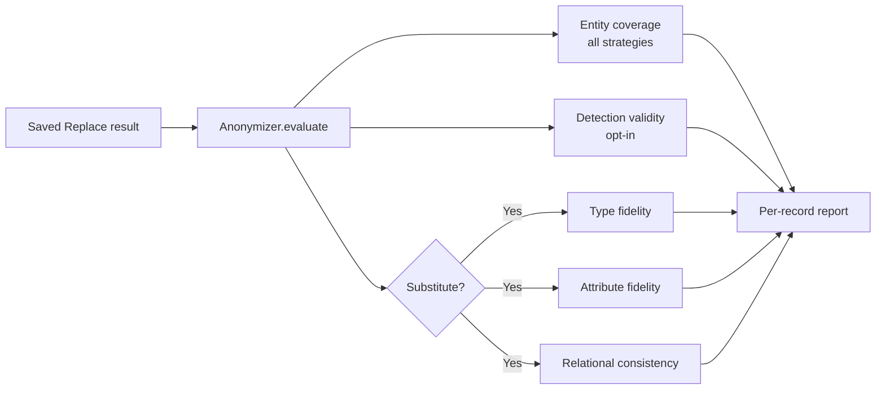

---
date:
  created: 2026-07-28
readtime: 10
authors:
  - memadi2026
---

# **After Anonymization — Part I: Evaluating Replace Mode**

<!-- SPDX-FileCopyrightText: Copyright (c) 2025-2026 NVIDIA CORPORATION & AFFILIATES. All rights reserved. -->
<!-- SPDX-License-Identifier: Apache-2.0 -->

In Replace mode, Anonymizer detects entities and transforms them according to the chosen strategy — substitute, redact, annotate, or hash. 

This leaves two open questions: did detection catch everything sensitive in the first place, and if Substitute was used, do the synthetic values hold together as a type-compatible, demographically coherent, internally consistent set? A record can pass a surface read and still have a name preserved in an email local-part, a city paired with the wrong postal code, or an age quietly shifted from adult to child.

This is Part 1 of a two-part series on evaluation in Anonymizer. It covers **Replace mode**: what the evaluation pipeline checks, what each score means, and how to use the results. In the upcoming part 2, we will cover Rewrite mode, where the evaluation questions are different.

<!-- more -->

---

## Anonymization and Evaluation as Separate Steps

Anonymizer deliberately separates anonymization from evaluation:

```text
source data
    ↓
preview() / run()          ← anonymization: detect + replace
    ↓
saved AnonymizerResult
    ↓
evaluate()                 ← quality check: LLM-as-judge scores
    ↓
per-record report
```

This boundary is a feature, not a limitation. It means:

- **Evaluation is optional.** Not every run needs a judge pass. Large batches can run without evaluation, while selected samples can be evaluated for audits or before deploying a configuration.
- **The result is reusable.** The same saved output can be evaluated multiple times — with different judge models or at a different time — without re-running entity detection and replacement.


```python
from anonymizer import Anonymizer, AnonymizerConfig, AnonymizerInput, Substitute

anonymizer = Anonymizer()

result = anonymizer.run(
    config=AnonymizerConfig(replace=Substitute()),
    data=AnonymizerInput(source="records.csv", text_column="text"),
)

# Evaluation is a separate call on the saved result.
evaluated = anonymizer.evaluate(result)
```

Because the anonymization mode and strategy travel with the result, `evaluate()` already knows whether to run the Substitute-specific judges. The user does not restate the strategy.

---

## Inside the Anonymizer Replace Evaluation Report

The judges that run depend on which Replace strategy was used.

**Entity coverage** runs for every strategy. It measures detection recall by independently identifying in-scope candidate values in the original text and checking whether Anonymizer detected them.

**Detection validity** is optional and shared across all strategies. It checks the precision side: were the entities Anonymizer *did* detect actually valid in context?

**Three additional judges** run only for Substitute, because Substitute generates new values that can fail in ways that Redact, Annotate, and Hash cannot.



---

## Entity Coverage: Did We Catch Everything?

Entity coverage measures how many unique, in-scope candidate values identified by the judge were also detected by Anonymizer.

An independent LLM judge extracts candidate values from the original text. Postprocessing removes out-of-scope, non-literal, and duplicate candidates, then compares the remaining values with Anonymizer's final entities. Unmatched candidates appear in `missed_entities`.

The score is computed per record:

```
entity_coverage = n_covered / n_candidates
```

A score of `1.0` means no judge candidates were missed, or the judge found no candidates. A lower score means the judge found candidate values missing from Anonymizer's final entities. Entity coverage measures detection recall, not final replacement quality.

| Output column | Meaning |
|---|---|
| `entity_coverage` | Float in `[0.0, 1.0]`, or `None` if the judge was unavailable |
| `missed_entities` | List of `{value, label, reasoning}` for each entity the judge found that Anonymizer missed |

Entity coverage always runs. No extra configuration is needed. The judge respects the entity scope configured for the run — if `entity_labels` was set, only entities of those types are considered in scope. If a `data_summary` was provided, it is passed to the judge to help interpret domain-specific values in context.

---

## Detection Validity: Were the Detected Entities Actually Sensitive?

Detection validity is the precision-side complement to entity coverage — it checks whether the entities Anonymizer flagged were actually sensitive in context.

It surfaces:

- **False positives** — ordinary words or boilerplate treated as sensitive.
- **Wrong labels** — a real entity assigned to a clearly incompatible category.
- **Wrong boundaries** — a partial span or one that absorbs surrounding text it should not.
- **Contextual mismatches** — a token that could be an entity elsewhere but isn't one in this sentence. The word `"Apple"` in a grocery note is different from `"Apple"` in an employment record.

| Output column | Meaning |
|---|---|
| `detection_valid` | `True` — all checked entities passed; `False` — one or more failed; `None` — judge unavailable |
| `detection_invalid_entities` | Flagged `{value, label, reasoning}` pairs |

Detection validity is **opt-in** because it involves subjective judgment. Whether a quasi-identifier like a job title or a region is "sensitive enough to flag" can depend on the dataset, the privacy policy, and the downstream use case. Enabling it by default could produce noise in contexts where liberal detection is intentional. To enable it:

```python
from anonymizer import EvaluateConfig

evaluated = anonymizer.evaluate(result, config=EvaluateConfig(compute_detection_validity=True))
```

---

## Substitute-Only Scores

The three judges below only run when the Replace strategy is `Substitute`, because Substitute generates new values. Redact, Annotate, and Hash do not create new content that can fail these checks.

### Type Fidelity

> Does each synthetic value still belong to the same entity class and have the expected format?

A phone number should stay phone-shaped. An email should stay email-shaped. A city should not become a country. Type fidelity works at the individual replacement level and anchors its decision in the original value — not whether the synthetic value is merely plausible in isolation.

| Output column | Meaning |
|---|---|
| `type_fidelity_valid` | Whether every replacement has compatible type and format |
| `type_fidelity_invalid_replacements` | Original, synthetic, label, and reasoning for each failure |

### Attribute Fidelity

> Does the replacement preserve salient attributes within the entity?

An age of `38` and an age of `8` are both valid ages. But replacing one with the other changes an adult into a child, which makes surrounding pronouns and context incoherent. Attribute fidelity currently focuses on clearly implied gender for names and age buckets for ages and dates of birth. Adjacent or ambiguous cases receive the benefit of the doubt — the judge catches clear semantic drift, not uncertain demographic assumptions.

| Output column | Meaning |
|---|---|
| `attribute_fidelity_valid` | Whether all applicable attributes were preserved |
| `attribute_fidelity_invalid_entities` | Entities, attributes checked, and explanations for clear failures |

### Relational Consistency

> Do the synthetic entities preserve the same coherence that existed among the originals?

Individual replacements can each pass while the record fails as a whole. A synthetic set with Portland as the city, Texas as the state, and 97205 as the postal code contains three individually plausible values that are geographically impossible together. Relational consistency checks supported relationships: city ↔ state, city ↔ postal code, date of birth ↔ age, person name ↔ email local-part.

| Output column | Meaning |
|---|---|
| `relational_consistency_valid` | Whether all checkable cross-entity relationships remain coherent |
| `relational_consistency_invalid_relations` | Participants and reasoning for each broken relationship |

---

## Reading the Report

The quickest per-record view:

```python
evaluated.display_record(0)
```

For Substitute, `display_record` shows the original text with detected entities highlighted, the replaced text with synthetic values highlighted, the four judge verdicts, detailed explanations for any failures, and the original-to-synthetic replacement map.

<div style="text-align: center;" markdown>

{ loading=lazy }

</div>

For a tabular summary across records:

```python
evaluated.dataframe[[
    "entity_coverage",
    "detection_valid",          # None unless compute_detection_validity=True
    "type_fidelity_valid",
    "attribute_fidelity_valid",
    "relational_consistency_valid",
]]
```

---

## Comparing Judge Models

The judge model for each role is configurable. This makes it straightforward to compare results across models — run `evaluate()` on the same saved result with different model configurations and compare scores side by side without paying to re-run anonymization.

```python
model_configs_gpt = """
selected_models:
  evaluate:
    entity_coverage_judge: gpt-oss-120b
    replace_type_fidelity_judge: gpt-oss-120b
    replace_attribute_fidelity_judge: gpt-oss-120b
    replace_relational_consistency_judge: gpt-oss-120b
"""

model_configs_nemotron = """
selected_models:
  evaluate:
    entity_coverage_judge: nemotron-super
    replace_type_fidelity_judge: nemotron-super
    replace_attribute_fidelity_judge: nemotron-super
    replace_relational_consistency_judge: nemotron-super
"""

evaluated_gpt = Anonymizer(model_configs=model_configs_gpt).evaluate(result)
evaluated_nemotron = Anonymizer(model_configs=model_configs_nemotron).evaluate(result)
```

Since the anonymized data does not change between runs, score differences are attributable to the judge, not the anonymization.

---

## Treat `None` as Unavailable, Not as a Pass

Each verdict has three meaningful states:

| Value | Interpretation |
|---|---|
| `True` | The judge ran and found no violation |
| `False` | The judge ran and found one or more violations |
| `None` | The row was not scored — timeout, provider failure, or dropped row |

`None` is never a quality pass. Inspect `evaluated.failed_records` to surface which rows were not scored, monitor unavailable verdict counts across runs, and decide whether your release policy should retry, block, or route those rows to human review.

---

## What the Scores Do Not Prove

The judges answer bounded questions. They do not certify anonymization.

- **Entity coverage** measures recall against one LLM judge's extraction — it is not ground truth. A judge that misses an entity still contributes a gap that coverage cannot measure.
- **Detection validity** measures precision of selected spans, not whether every sensitive value in the source was found.
- **Type fidelity** checks structural compatibility, not every semantic property of the original.
- **Attribute fidelity** limits itself to supported, defensible attributes.
- **Relational consistency** checks known entity relationships, not arbitrary real-world truth.

Use the scores as one layer in a broader process. Preview representative records, inspect detailed failures, evaluate against annotated data when available, and apply human review where the risk requires it.

---

## The Bottom Line

`evaluate()` answers the question `run()` cannot: did the anonymization hold together end to end?

Entity coverage surfaces recall gaps — entities that made it through. Detection validity surfaces precision gaps — entities that should not have been flagged. For Substitute, type fidelity, attribute fidelity, and relational consistency surface the ways new values can silently break the record's internal logic.

The separation between `run()` and `evaluate()` is what makes the workflow practical: anonymize at scale, save the result, and evaluate when and how the use case demands.

> The cost of skipping evaluation is not visible in the output. It is visible in the edge cases that reach production.

For API details and the complete output schema, see [Evaluation](../../concepts/evaluation.md). For strategy selection, see [Choosing a Strategy](../../concepts/choosing-a-strategy.md).
