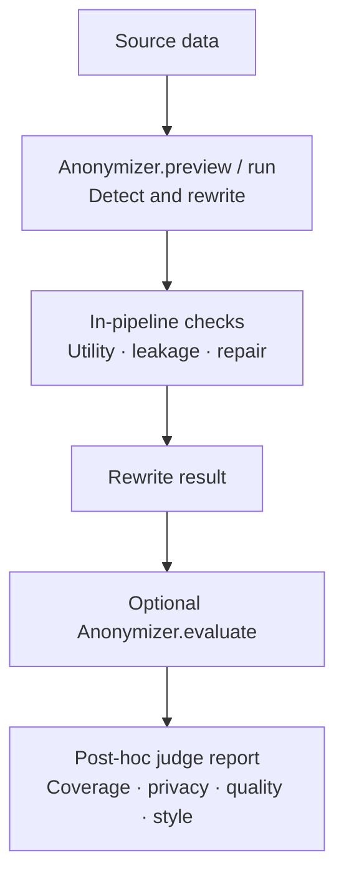
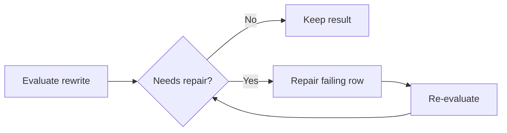

---
date:
  created: 2026-08-07
readtime: 10
authors:
  - memadi-nv
---

# **After Anonymization — Part II: Evaluating Rewrite Mode**

<!-- SPDX-FileCopyrightText: Copyright (c) 2025-2026 NVIDIA CORPORATION & AFFILIATES. All rights reserved. -->
<!-- SPDX-License-Identifier: Apache-2.0 -->

Return to the customer biographies from Part 1. Replace mode changed the explicit identifiers, but this time the data must meet a stricter privacy requirement. Even after names and addresses are replaced, a rare occupation, an exact sequence of life events, or a distinctive combination of hometown and employer may still identify someone.

You use NeMo Anonymizer's Rewrite mode to protect information conveyed by latent entities and combinations of identifying clues. It transforms the full record—not just explicit identifiers—while preserving the meaning that still matters. Rewriting introduces a tradeoff: the output can retain identifying clues or lose useful information.

During `run()` or `preview()`, Rewrite checks each generated record for how much protected information can still be deduced and how much important meaning was preserved. Those results drive the repair iterations. After anonymization, an optional `evaluate()` call provides a broader review of entity detection coverage, privacy, quality, and style.

This is Part 2 of a two-part series on evaluation in Anonymizer. Part 1 covers Replace mode; this article explains the two evaluation layers used by **Rewrite mode**, what each score means, and how to inspect the results.

<!-- more -->

---

## Rewrite Evaluation Has Two Layers

Unlike Replace mode, Rewrite mode evaluates every generated rewrite as part of `preview()` or `run()`. A separate `evaluate()` call adds independent LLM-as-judge feedback:



The in-pipeline checks drive the repair loop and `needs_human_review`. The post-hoc judge evaluation is informational: it adds judge outputs but does not rewrite the text again or change the existing human-review decision.

```python
from anonymizer import Anonymizer, AnonymizerConfig, AnonymizerInput, Rewrite

anonymizer = Anonymizer()

result = anonymizer.run(
    config=AnonymizerConfig(rewrite=Rewrite()),
    data=AnonymizerInput(source="records.csv", text_column="text"),
)

# In-pipeline metrics are already present after run().
pipeline_metric_columns = [
    "utility_score",
    "leakage_mass",
    "weighted_leakage_rate",
    "needs_human_review",
]
pipeline_scores = result.dataframe[pipeline_metric_columns]

# A separate call adds post-hoc judge outputs.
evaluated = anonymizer.evaluate(result)
posthoc_scores = evaluated.dataframe[["entity_coverage", "judge_evaluation"]]
```

As in Replace mode, the completed result is reusable. You can run `evaluate()` immediately or save the complete `AnonymizerResult` or `PreviewResult` with Python's `pickle` module and evaluate it later. Save the result object—not just its `dataframe`—so the Rewrite configuration and evaluation context remain available.

---

## In-Pipeline Checks: Did the Rewrite Balance Privacy and Utility?

During `run()` or `preview()`, Anonymizer creates quality questions from the original record and privacy questions from the detected entities and their sensitivity dispositions. It answers those questions against the rewritten text, computes per-record metrics, and repairs rows that exceed the configured privacy threshold.

### Utility Score: Was Important Meaning Preserved?

`utility_score` measures how well the rewritten text answers questions about the original record. Scores range from `0.0` to `1.0`; higher is better.

Critical meaning units count twice as much as important ones:

```text
utility_score = weighted mean of per-question answer scores
```

A high score means the rewrite retained the important facts and relationships. It does not require verbatim wording or every identifying detail to survive.

### Leakage Mass: What Identifying Information Remains?

The privacy check tests whether each protected value can still be identified or inferred from the rewrite. Every leaked item contributes its sensitivity weight multiplied by the judge's confidence:

```text
leakage_mass = Σ(sensitivity_weight × leak_confidence)
```

High-, medium-, and low-sensitivity items carry weights of `1.0`, `0.6`, and `0.3`. Lower leakage mass is better, but it is not bounded at `1.0` because several items can leak in one record.

`weighted_leakage_rate` normalizes that mass by the maximum possible leakage for the record:

```text
weighted_leakage_rate = leakage_mass / maximum_possible_leakage_mass
```

It ranges from `0.0` to `1.0`. `any_high_leaked` separately records whether at least one high-sensitivity item leaked.

<div class="output-columns-table" markdown>

| Output column | Meaning |
|---|---|
| `utility_score` | Meaning preservation from `0.0` to `1.0`; higher is better |
| `leakage_mass` | Confidence-weighted sum of leaked items; lower is better |
| `weighted_leakage_rate` | Leakage normalized to the record's maximum possible mass |
| `any_high_leaked` | Whether any high-sensitivity item leaked |

</div>

### Repair Loop: Can a Failing Rewrite Be Improved?

After the initial checks, rows above the repair threshold—or rows with a high-sensitivity leak when the selected risk tolerance requires it—enter the repair loop. Only failing rows are repaired and checked again. The loop stops when they pass or reach `max_repair_iterations`.



`risk_tolerance` controls the repair and review thresholds. The default is `low`; use `minimal` for a stricter posture or `moderate` / `high` for more tolerance. Setting `max_repair_iterations=0` disables repair but still computes the in-pipeline metrics.

### Human Review: Which Records Still Need Attention?

After repair ends, `needs_human_review` becomes `True` when the rewrite is missing, a high-sensitivity item still leaks, utility falls below the selected preset's threshold, or leakage mass exceeds its review threshold.

<div class="output-columns-table" markdown>

| Output column | Meaning |
|---|---|
| `needs_human_review` | Final review flag based on in-pipeline metrics |

</div>

Records with no detected entities skip rewriting and pass through unchanged with `utility_score=1.0`, `leakage_mass=0.0`, and `needs_human_review=False`.

---

## Post-Hoc Evaluation: What Does an Independent Judge See?

Calling `evaluate()` adds entity coverage and a holistic rewrite judgment. Detection validity can also be enabled when you want a precision-side audit of the detected entities.

### Entity Coverage: Were All In-Scope Entities Detected?

Entity coverage measures how many unique, in-scope candidate values identified by the judge were also detected by Anonymizer.

An independent LLM judge extracts candidate values from the original text. Postprocessing removes out-of-scope, non-literal, and duplicate candidates, then compares the remaining values with Anonymizer's detected entities. Unmatched candidates appear in `missed_entities`.

```text
entity_coverage = n_covered / n_candidates
```

A score of `1.0` means no judge candidates were missed, or the judge found no candidates. A lower score means the judge found candidate values not covered by Anonymizer's detected entities. Entity coverage measures detection recall, not whether the rewritten text still leaks those values.

A score below `1.0` is a review signal, not definitive evidence of a privacy failure. Review the `missed_entities` entries in context: judge candidates can be ambiguous, and whether broad values require protection depends on your privacy policy.

<div class="output-columns-table" markdown>

| Output column | Meaning |
|---|---|
| `entity_coverage` | Float in `[0.0, 1.0]`, or `None` if the judge was unavailable |
| `missed_entities` | List of `{value, label, reasoning}` for each entity the judge found that Anonymizer missed |

</div>

Entity coverage always runs during post-hoc evaluation. The judge respects the entity scope configured for the run—if `entity_labels` was set, only entities of those types are considered in scope. If a `data_summary` was provided, it helps the judge interpret domain-specific values in context.

### Privacy: Did the Rewrite Reduce Linkage Risk?

The privacy rubric compares the rewritten record with the original and estimates whether a realistic attacker could link them. It considers surviving direct identifiers and distinctive combinations of quasi-identifiers.

- `high` — direct identifiers are removed and remaining details create low linkage risk.
- `medium` — no obvious direct identifier remains, but a distinctive bundle creates noticeable risk.
- `low` — the record remains easily or near-certainly linkable.

### Quality: Was the Record's Meaning Preserved?

The quality rubric evaluates important facts, relationships, chronology, and conclusions independently from privacy and writing style.

- `high` — important meaning, facts, and structure are fully preserved.
- `medium` — most content is preserved with minor loss or distortion.
- `low` — important information is materially lost, contradicted, or distorted.

### Style: Does the Rewrite Read Naturally?

The style rubric evaluates fluency, grammar, clarity, coherence, and whether the result reads like human-written prose.

- `high` — fluent, coherent, and natural.
- `medium` — readable with isolated awkward phrasing.
- `low` — noticeably unnatural, broken, or placeholder-like.

All three rubric results are stored together:

```python
evaluated.dataframe.loc[0, "judge_evaluation"]

# {
#     "privacy": {"score": "high", "reasoning": "..."},
#     "quality": {"score": "medium", "reasoning": "..."},
#     "style": {"score": "high", "reasoning": "..."},
# }
```

These rubric scores are informational. They do not trigger repair and do not modify `needs_human_review`.

### Detection Validity: Were the Detected Entities Valid in Context?

Detection validity is the optional precision-side complement to entity coverage. In Rewrite mode, `detection_valid` is the fraction of detected `(value, label)` pairs that passed, from `0.0` to `1.0`.

It surfaces false positives, wrong labels, wrong boundaries, and values that could be sensitive elsewhere but are not sensitive in the context of the original record.

***Note:*** Detection-validity judgments are particularly sensitive to entity label names and wording. Ambiguous, overlapping, or domain-specific labels can change how the judge interprets the same detected value, so review flagged wrong-label cases against your configured taxonomy.

```python
from anonymizer import EvaluateConfig

evaluated = anonymizer.evaluate(
    result,
    config=EvaluateConfig(compute_detection_validity=True),
)
```

<div class="output-columns-table" markdown>

| Output column | Meaning |
|---|---|
| `detection_valid` | Fraction of detected entities that passed, or `None` if unavailable |
| `detection_invalid_entities` | Flagged `{value, label, reasoning}` entries |

</div>

Detection validity is **opt-in** and is intended primarily for model and threshold evaluation. A score of `1.0` means all checked detections passed; a lower score is the fraction that passed. What counts as an acceptable sensitive-entity detection can depend on the dataset, privacy policy, and desired label granularity.

---

## Reading the Report

To inspect the first record (row `0`):

```python
evaluated.display_record(0)
```

The Rewrite report shows the original and rewritten text, in-pipeline utility and leakage metrics, the human-review flag, post-hoc privacy / quality / style scores, entity coverage, and the entity disposition used to guide protection. When detection validity is enabled, that score and any flagged detections also appear.

<div style="text-align: center;" markdown>

{ loading=lazy }

</div>

For a tabular summary across records:

```python
evaluated.dataframe[[
    "utility_score",
    "leakage_mass",
    "weighted_leakage_rate",
    "needs_human_review",
    "entity_coverage",
    "judge_evaluation",
    # "detection_valid",  # Add only when compute_detection_validity=True
]]
```

---

## Comparing Judge Models

The judge model for each post-hoc role is configurable. This makes it straightforward to compare results across models—run `evaluate()` on the same original, unevaluated Rewrite result with different model configurations without paying to re-run detection, rewriting, or repair.

```python
model_configs_nemotron = """
selected_models:
  evaluate:
    entity_coverage_judge: nemotron-super
    rewrite_judge: nemotron-30b-thinking
"""

model_configs_gpt = """
selected_models:
  evaluate:
    entity_coverage_judge: gpt-oss-120b
    rewrite_judge: gpt-oss-120b
"""

evaluated_nemotron = Anonymizer(model_configs=model_configs_nemotron).evaluate(result)
evaluated_gpt = Anonymizer(model_configs=model_configs_gpt).evaluate(result)
```

The entity coverage judge defaults to `nemotron-super`; the holistic Rewrite judge defaults to `nemotron-30b-thinking`. Detection validity uses the shared `detection_validity_judge` role and defaults to `gpt-oss-120b`.

Because the rewritten data does not change between these calls, differences come from the evaluation layer rather than rewriting. They may reflect the selected model, LLM nondeterminism, provider behavior, or other evaluation-time differences.

---

## What the Scores Do Not Prove

The metrics and judges answer bounded questions. They do not certify that a rewrite is anonymous.

- **Utility score** measures preservation through generated questions; it can miss meaning that no question captured.
- **Leakage metrics** test known protected values and inferences; they do not model every possible attacker or external dataset.
- **Entity coverage** depends on one judge's candidate extraction and is not ground truth.
- **Detection validity** measures precision of detected entities, not whether all sensitive information was found.
- **Privacy, quality, and style** are coarse holistic judgments, not guarantees.

Use these signals together. Review representative records, inspect failures and entity dispositions, evaluate against annotated data when available, and apply human review where the risk requires it.

---

## The Bottom Line

Rewrite evaluation is not a single final score. The in-pipeline checks measure utility and leakage, repair failing rows, and flag unresolved risk. The optional post-hoc judge evaluation adds independent evidence about detection coverage and the rewrite's overall privacy, quality, and style.

That separation supports two workflows: use the in-pipeline metrics to control generation, then apply post-hoc judges when you need a broader audit of completed results.

Skipping post-hoc evaluation can leave detection gaps and holistic privacy, quality, or style problems unnoticed until affected records reach downstream systems.

For API details and the complete output schema, see [Evaluation](../../concepts/evaluation.md). For Rewrite configuration and risk tolerance, see [Rewrite](../../concepts/rewrite.md).
