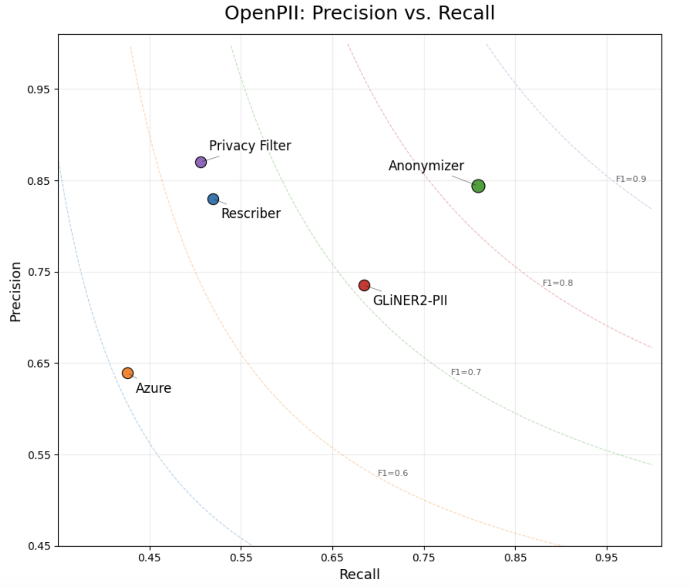
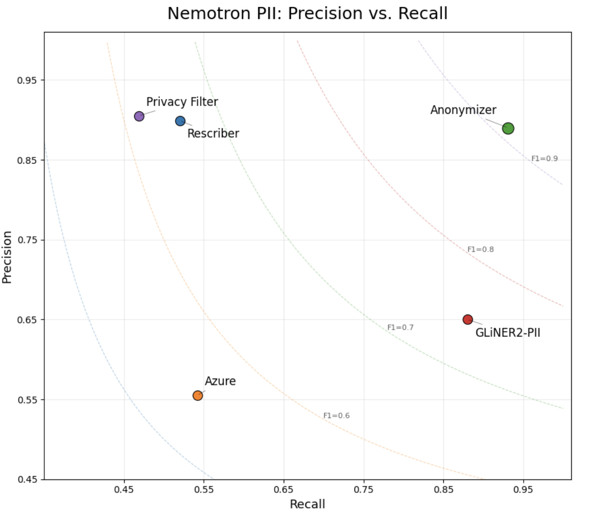
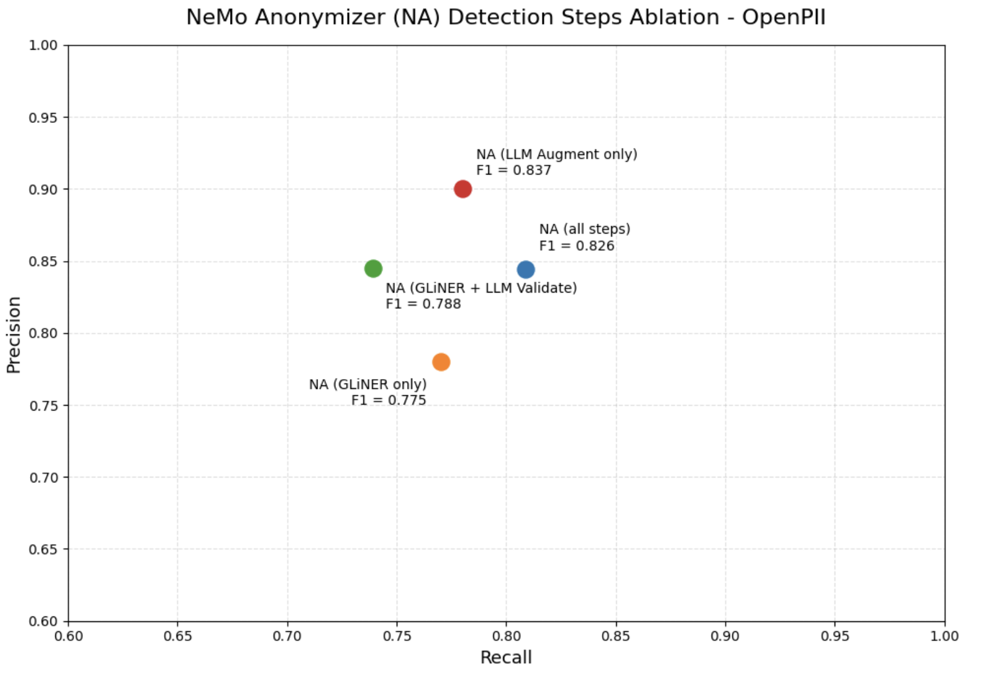
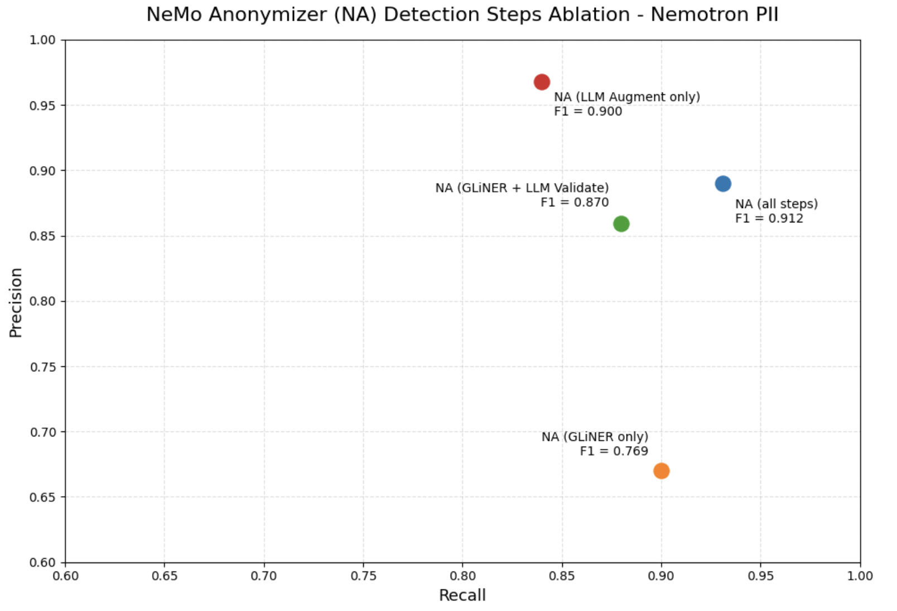

---
date:
  created: 2026-09-01
readtime: 9
authors:
  - asteier2026
---

# **Hybrid Entity Detection: Why One Model Shouldn't Do Everything**

<!-- SPDX-FileCopyrightText: Copyright (c) 2025-2026 NVIDIA CORPORATION & AFFILIATES. All rights reserved. -->
<!-- SPDX-License-Identifier: Apache-2.0 -->

You've just replaced your old regex pipeline with a modern entity detector.

The integration took an afternoon.

The demo looked great.

Names? Found. Addresses? Found. Phone numbers? Found. Credit cards? Found.

Confident, you point it at your own data.

The customer account numbers are still there. The employee IDs are still there. The internal ticket identifiers are still there.

You assume it's a bug. You check the output. You check the labels.

Everything is working exactly as designed.

**The detector didn't miss the entity.**

**It never knew that kind of entity existed.**

<!-- more -->

Traditional named entity recognition models are built around fixed ontologies — a predefined vocabulary of entity types they can recognize. If an identifier isn't in that vocabulary, it simply isn't part of the task.

Modern configurable detectors such as GLiNER[^1] changed that. Instead of relying on a fixed ontology, developers can specify the entity types they want to detect, dramatically expanding what can be extracted without retraining.

That's a huge step forward. But it still doesn't solve entity detection.

Even when a detector knows what it's looking for, entity detection is still hard. Explicit identifiers are missed. False positives happen. Labels are ambiguous. The challenge shifts from *"Can this detector recognize this kind of entity?"* to *"Did this detector make the right decision in this document?"*

Our first instinct was the obvious one:

> **Why not let an LLM do all the work?**

Because we weren't trying to replace a good detector.

We were trying to make a good one even better.

Dedicated entity detectors excel at structured extraction. Given a set of entity types, they're fast, consistent, and remarkably good at finding explicit identifiers. LLMs bring a different strength: contextual reasoning. They're good at judging ambiguous cases, correcting mistakes, and recognizing entities that structured extraction can still overlook.

Rather than asking one model to solve every problem, we split entity detection into three specialized tasks.

One stage proposes candidate entities.

One stage reviews them and decides only three things: **keep**, **drop**, or **reclassify**.

One stage rereads the original document and asks a completely different question:

> **What explicit entities did we miss?**

Each stage has one job.

Together, they consistently outperform any stage operating alone.

## One Problem. Three Specialized Tasks

The obvious way to build an entity detection pipeline is to ask one model a single question:

> **Find every entity that should be protected.**

It sounds simple. In practice, that question hides several different problems.

Some entities need to be found. Some need to be discarded. Others have the wrong boundaries or the wrong label. And even after all of that, some entities were never detected in the first place.

Those aren't variations of the same task — they're different kinds of reasoning. So instead of asking one model to do everything, we split entity detection into three specialized stages.

Although Anonymizer supports both Replace and Rewrite workflows, both begin with the same explicit entity detection pipeline described here. Rewrite builds on this foundation with additional stages for contextual reasoning beyond explicit entities, which will be explored in a future developer note.

{ loading=lazy }

### Candidate Detection

The first stage asks only one question:

> **What might be an entity?**

Its job is to cast a wide net.

In our implementation, we use GLiNER2-PII[^2] because it combines strong extraction performance with a flexible ontology. However, the architecture isn't tied to GLiNER. Any detector capable of proposing candidate entities could fill this role.

### Validation

Once candidate entities exist, the problem changes. The question is no longer:

> **What entities are present?**

It's now:

> **Was this candidate the right decision?**

Validation never searches for new entities. It simply reviews each candidate produced by the first stage and decides whether to keep, drop, or reclassify it. That's fundamentally a reasoning task, making it a natural fit for an LLM.

Augmentation runs after validation, so entities it recovers are added directly to the final set rather than being sent back through another validation pass. Validating GLiNER's candidates makes sense because GLiNER trades some precision for recall; validating the augmenter's own suggestions would mean asking an LLM to second-guess itself, and augmented entities are already high precision.

### Augmentation

After validation, we deliberately start over.

Instead of continuing from the validated entities, the final stage rereads the original document and asks a different question:

> **What explicit entities haven't been identified yet?**

This stage isn't correcting earlier decisions. It's looking for entities that were never proposed as candidates.

Because that requires open-ended reasoning over the document, we also implement this stage with an LLM.

### Design Rationale

Each stage is solving a different problem. The detector is optimized for structured extraction. The validator is optimized for contextual judgment. The augmenter is optimized for recovering missed entities.

No stage is trying to solve entity detection by itself. Instead, each stage focuses on a single, well-defined responsibility.

Validation primarily improves precision by removing incorrect candidates and correcting labels. Augmentation improves recall by recovering entities that never entered the pipeline. More importantly, it contributes a different style of reasoning than candidate detection. The two stages make different kinds of mistakes, allowing them to complement rather than replace each other.

The result isn't a competition between NER detection and an LLM. It's a collaboration between structured extraction and contextual reasoning.

**One problem. Three specialized reasoning tasks.**

As the next section shows, each stage contributes measurable improvements, and together they consistently outperform any individual stage operating alone.

## Results

### Overall Benchmark Performance

The systems evaluated represent a range of anonymization approaches, including traditional NER services (Azure AI Language[^3]), configurable entity detection (GLiNER2-PII), LLM-based anonymization (Rescriber[^4]), hybrid detection (Anonymizer), and pipeline-based anonymization (Privacy Filter[^5]). Azure AI Language, Privacy Filter, and Rescriber operate with predefined entity ontologies, whereas GLiNER2-PII supports configurable entity types. Anonymizer builds on configurable detection while adding validation and augmentation stages that reason over context.

Because these systems support different entity ontologies, recall differences may reflect either unsupported entity types or failures to detect supported entities. We return to this distinction when interpreting the results.

We evaluated each system on two benchmarks: Ai4Privacy's OpenPII[^6] and Nemotron PII[^7] (1,000 records from each dataset). OpenPII contains a broad range of real-world PII, including personal identifiers, contact information, organizations, locations, financial identifiers, and other common entity types. Nemotron PII contains a broader and more diverse collection of entity types, including additional quasi-identifiers and contextual attributes representative of modern LLM privacy challenges.

The two systems that use an LLM, Rescriber and Anonymizer, used gpt-oss-120b.

{ loading=lazy }

{ loading=lazy }

*Note: We excluded NVIDIA GLiNER and the latest Privacy Filter model from these comparisons because both were fine-tuned on Nemotron PII. Since Nemotron PII is one of our evaluation benchmarks, including systems trained directly on that dataset would not provide a fair comparison.*

The obvious question is whether decomposing entity detection into specialized reasoning stages actually improves performance.

The results suggest that it does. Across both OpenPII and Nemotron PII, Anonymizer achieved the strongest overall balance between precision and recall, outperforming Azure, Privacy Filter, Rescriber, and GLiNER2-PII.

One result was particularly noteworthy. GLiNER2-PII was already an exceptionally strong candidate detector. Rather than replacing it, the hybrid pipeline consistently improved upon its performance by combining structured extraction with specialized reasoning. This reinforced one of the central design goals of the architecture: use each component for the task it performs best, rather than asking a single model to solve every aspect of entity detection.

### Interpreting the Results Fairly

| System | Ontology Coverage | Original Recall | Supported Recall |
| --- | --- | --- | --- |
| Azure | 89.7% | 42.6% | 44.0% |
| Privacy Filter | 78.8% | 50.6% | 57.6% |
| Rescriber | 100.0% | 51.9% | 51.9% |
| Anonymizer | 100.0% | 80.9% | 80.9% |
| GLiNER2-PII | 100.0% | 68.5% | 68.5% |

*Table 1. Ontology-aware evaluation on OpenPII.*

| System | Ontology Coverage | Original Recall | Supported Recall |
| --- | --- | --- | --- |
| Azure | 73.6% | 54.0% | 62.9% |
| Privacy Filter | 74.8% | 46.9% | 56.9% |
| Rescriber | 100.0% | 52.0% | 52.0% |
| Anonymizer | 100.0% | 93.1% | 93.1% |
| GLiNER2-PII | 100.0% | 87.9% | 87.9% |

*Table 2. Ontology-aware evaluation on Nemotron PII.*

*Table Note: Ontology coverage is the proportion of benchmark entities whose types fall within a system's supported label set. Supported recall is recalculated using only those entities. Rescriber's predefined ontology covers the complete benchmark ontology, while GLiNER2-PII and Anonymizer were configured with the complete ontology; therefore, their original and supported recall values are identical.*

Those results raise a second question: are we comparing these systems fairly?

Raw recall does not tell the entire story because a missed entity can reflect two different limitations:

- the system supports the entity type but failed to detect the entity, or
- the entity type falls outside the system's supported ontology.

To distinguish these cases, we measured ontology coverage: the percentage of benchmark entities whose types the system could theoretically detect based on its supported labels. We then calculated supported recall using only entities whose types fall within that ontology. Supported recall is therefore recomputed on the supported subset; it is not obtained by simply dividing original recall by ontology coverage.

The results show that ontology coverage explains part — but not all — of the performance gap. Azure AI Language and Privacy Filter cover only a subset of the entity types represented in OpenPII and Nemotron PII. Their original recall therefore reflects both detection failures and entities they were not designed to recognize. Restricting the evaluation to supported entity types improves their recall, particularly on Nemotron PII, but their supported recall remains well below their theoretical ceiling. Many of their misses are therefore supported entities that the systems nevertheless failed to detect.

Rescriber covers all entity types represented in both benchmarks despite operating with a predefined ontology. GLiNER2-PII and Anonymizer achieve full coverage by accepting a configurable set of entity types and were evaluated using the complete benchmark ontology. For these three systems, original recall and supported recall are identical because no benchmark entities are excluded by the coverage adjustment. Their remaining misses reflect detection performance rather than ontology limitations.

Separating ontology coverage from supported detection performance makes the source of each system's errors more visible. It prevents systems from being penalized without explanation for entity types outside their scope, while also showing that broader ontology coverage alone does not guarantee stronger recall.

### Where the Gains Come From

{ loading=lazy }

{ loading=lazy }

If the complete pipeline performs better, which stages are responsible for the improvement?

The ablation study helps answer that question. These configurations are evaluation variants used to isolate each stage's contribution; Anonymizer itself runs the complete three-stage pipeline.

GLiNER2-PII provides strong candidate generation. Validation then improves precision by removing incorrect candidates and correcting entity classifications. Augmentation contributes a different capability: it rereads the original document to recover explicit entities that candidate detection missed.

The complete pipeline achieves the highest recall on both benchmarks while maintaining strong precision. On Nemotron PII, it also produces the highest overall F1 score. On OpenPII, augmentation alone achieves a slightly higher F1 score, reflecting its exceptionally high precision, but it finds fewer entities than the complete pipeline. Because missed sensitive entities are generally more consequential than additional candidates that can be validated, Anonymizer uses all three stages together.

These aggregate results span a broad and challenging range of entity types, including identifiers that are ambiguous or depend heavily on context. They are intended to compare system behavior across difficult benchmarks, not to represent a production recall guarantee for every entity category or deployment.

The gain therefore does not come from any single stage operating alone. It comes from combining complementary forms of detection and reasoning: structured candidate generation for coverage, validation for precision, and augmentation for recovery of missed entities.

## Discussion

One lesson from this work is that stronger AI systems don't always come from larger models or longer prompts. Sometimes they come from decomposing a difficult task into simpler reasoning problems.

Entity detection illustrates this well.

Candidate generation, validation, and augmentation each require different kinds of reasoning. Asking a single model to perform all three simultaneously forces it to optimize competing objectives. Separating them allows each stage to focus on one well-defined question before passing its output to the next.

This decomposition also makes the pipeline easier to understand and evolve. Candidate detection can be improved independently of validation. Validation can adopt new reasoning models without changing augmentation. Better candidate detectors can be incorporated without redesigning the overall architecture.

While this article focused on entity detection, the same principle applies more broadly. Many AI pipelines combine retrieval, classification, verification, planning, or generation into a single prompt. Breaking those responsibilities into specialized stages may produce systems that are not only more accurate, but also easier to evaluate and improve.

We began this project thinking we needed a better entity detector.
Instead, we discovered we already had an excellent detector. What it needed wasn't replacement — it needed teammates.

GLiNER excels at structured extraction, while LLMs excel at contextual reasoning. By allowing each to do what it does best, the hybrid pipeline consistently outperformed either approach alone.

Sometimes the hardest AI problems aren't solved by asking one model to reason harder.
They're solved by asking several models simpler questions.

**We didn't replace the detector. We gave it teammates.**

*One problem. Three specialized reasoning tasks.*

## References

[^1]: GLiNER: [Paper](https://arxiv.org/abs/2311.08526); [Hugging Face model](https://huggingface.co/urchade/gliner_large-v2.1)
[^2]: GLiNER2-PII: [Paper](https://arxiv.org/abs/2605.09973); [Hugging Face model](https://huggingface.co/fastino/gliner2-privacy-filter-PII-multi)
[^3]: Azure AI Language PII Detection: [Documentation](https://learn.microsoft.com/en-us/azure/ai-services/language-service/personally-identifiable-information/overview)
[^4]: Rescriber: [GitHub](https://github.com/PEACH-Research-Lab/Rescriber)
[^5]: Privacy Filter: [Hugging Face model](https://huggingface.co/openai/privacy-filter); [OpenAI Introduction](https://openai.com/index/introducing-openai-privacy-filter/)
[^6]: OpenPII Benchmark: [Hugging Face dataset](https://huggingface.co/datasets/ai4privacy/pii-masking-openpii-1.5m)
[^7]: Nemotron PII Benchmark: [Hugging Face dataset](https://huggingface.co/datasets/nvidia/Nemotron-PII)
