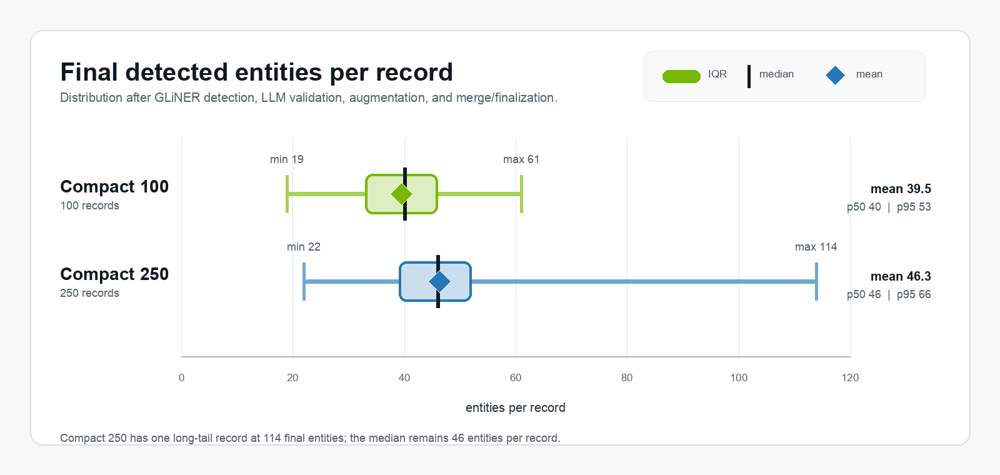

---
date:
  created: 2026-07-07
readtime: 11
authors:
  - lipikaramaswamy
---

# **Running NeMo Anonymizer Fully Self-Hosted on One B300**

<!-- SPDX-FileCopyrightText: Copyright (c) 2025-2026 NVIDIA CORPORATION & AFFILIATES. All rights reserved. -->
<!-- SPDX-License-Identifier: Apache-2.0 -->

Can Anonymizer run fully self-hosted and still process a real batch in minutes? The question comes up whenever sensitive data can't leave your infrastructure — think of an internal legal dataset that still needs realistic anonymized text for testing, review, or downstream model work. In that setting, self-hosting isn't just a deployment preference; it's what decides where the privacy boundary sits.

This devnote takes on that problem with a single [B300](https://www.nvidia.com/en-us/data-center/dgx-b300/) instance on [Brev](https://brev.nvidia.com/). Every model the pipeline touches runs on that one GPU: Qwen behind vLLM and GLiNER behind Anonymizer's reference OpenAI-compatible server, with Anonymizer pointed at localhost. Nothing leaves the box.

> The result: one warm Anonymizer call processed 250 compact legal records in under 9 minutes. No managed remote model API was in the loop.

<!-- more -->

<div style="text-align: center;" markdown>

{ loading=lazy }

</div>

---

## The Setup

The run uses Anonymizer's [**Replace** mode](../../concepts/replace.md) with `Substitute`: Anonymizer detects sensitive spans, asks an LLM to validate and augment the detections, then generates realistic replacements for the final entity set. This is not the more comprehensive Rewrite pipeline nor does it include a `.evaluate()` quality run. The goal here was narrower:

> Can Anonymizer run end-to-end with self-hosted models, keep the local GPU endpoint busy, and measure the actual warm-batch cost?

The dataset was a compact legal-record slice from [`mattmdjaga/text-anonymization-benchmark-train`](https://huggingface.co/datasets/mattmdjaga/text-anonymization-benchmark-train). The records are legal-style documents, dense with dates, court names, application IDs, names, locations, organizations, occupations, nationalities, monetary amounts, and other sensitive spans. For repeatability, the slice was built by sorting the train split by text length and taking the first 100 and 250 records.

| Slice | Records | Total chars | Longest record chars | Dataset reference spans |
|---|---:|---:|---:|---:|
| Compact 100 | 100 | 239,764 | 2,773 | 3,374 |
| Compact 250 | 250 | 730,787 | 3,729 | 9,525 |

`Dataset reference spans` are the entity annotations shipped with the dataset. They are useful for describing how entity-dense the slice is and for a rough recall check, but they are not Anonymizer's policy: Anonymizer may find additional sensitive spans and may disregard generic references that the dataset annotates.

The prepared slice used by the run had a `doc_id` column and a `text` column. The benchmark annotations were preserved for reporting dataset density, but Anonymizer only consumed the text. The dataset revision pin makes the input stable; `idx` is the original dataset order and acts as a deterministic tie-breaker after sorting by text length.

```python
import json

import pandas as pd
from datasets import load_dataset


TAB_REVISION = "f0b7eeb6e53e8b23f88ee4279b8c7154f110e25e"


def annotation_union(annotations: dict) -> list[dict]:
    spans = {}
    for annotator, payload in (annotations or {}).items():
        for entity in (payload or {}).get("entity_mentions") or []:
            key = (
                int(entity.get("start_offset") or 0),
                int(entity.get("end_offset") or 0),
                entity.get("span_text") or "",
                entity.get("entity_type") or "",
            )
            spans.setdefault(key, {**entity, "annotators": []})
            spans[key]["annotators"].append(annotator)
    return list(spans.values())


rows = []
for idx, row in enumerate(
    load_dataset(
        "mattmdjaga/text-anonymization-benchmark-train",
        revision=TAB_REVISION,
        split="train",
    )
):
    reference_spans = annotation_union(row["annotations"])
    rows.append(
        {
            "idx": idx,
            "doc_id": row["doc_id"],
            "text": row["text"],
            "char_len": len(row["text"]),
            "reference_span_count": len(reference_spans),
            "reference_spans_json": json.dumps(reference_spans, ensure_ascii=False),
        }
    )

df = pd.DataFrame(rows).sort_values(["char_len", "idx"]).reset_index(drop=True)
df.head(100).to_parquet("tab_train_compact_100.parquet", index=False)
df.head(250).to_parquet("tab_train_compact_250.parquet", index=False)
```

## The Local Stack

The run used one Brev B300 SXM6 instance: one GPU, 275,040 MiB visible VRAM, and an hourly price of **\$9.49**. Everything Anonymizer called was on localhost.

There were two local services:

- `qwen-prod` on `127.0.0.1:8001` for LLM validation, augmentation, and substitute generation. This served `nvidia/Qwen3.6-35B-A3B-NVFP4` with vLLM 0.23.0.
- `gliner-pii-detector` on `127.0.0.1:9000` for first-pass entity detection. This used the bundled GLiNER OpenAI-compatible server with `nvidia/gliner-pii`.

The Qwen endpoint was the only LLM endpoint in the run:

```bash
mkdir -p logs

CUDA_ROOT="$PWD/.venv/lib/python3.12/site-packages/nvidia/cu13"

CUDA_HOME="$CUDA_ROOT" \
PATH="$CUDA_ROOT/bin:$PWD/.venv/bin:$PATH" \
LD_LIBRARY_PATH="$CUDA_ROOT/lib:$CUDA_ROOT/lib64:${LD_LIBRARY_PATH:-}" \
VLLM_USE_FLASHINFER_SAMPLER=0 \
VLLM_DISABLED_KERNELS=FlashInferFP8ScaledMMLinearKernel \
nohup .venv/bin/vllm serve nvidia/Qwen3.6-35B-A3B-NVFP4 \
  --served-model-name qwen-prod \
  --host 127.0.0.1 \
  --port 8001 \
  --max-model-len 8192 \
  --gpu-memory-utilization 0.45 \
  --max-num-seqs 32 \
  --attention-backend FLASH_ATTN \
  --trust-remote-code \
  > logs/qwen-vllm.log 2>&1 &
```

The `CUDA_ROOT` path above is specific to the Brev B300 SXM6 environment used for this run: a Python 3.12 virtualenv with NVIDIA cu13 wheels installed under `.venv`. If CUDA is installed differently, point `CUDA_ROOT` at that runtime instead, or drop the override if system CUDA is already visible.

`--max-model-len 8192` is also a real sizing knob. The Qwen role below allows up to `max_tokens: 4096` for augmentation and substitute generation, leaving the remaining context for prompt, schema, source text, and entity lists. That was enough for this compact TAB slice, but denser records may need a larger context window, smaller validation chunks, or shorter generation limits.

`--gpu-memory-utilization 0.45` was a conservative co-location setting, not a compute throttle. In vLLM it controls the GPU memory budget for model weights and KV cache. Qwen could use more memory if the run needed a larger KV cache, but this setting left headroom for the GLiNER server on the same GPU and still completed the measured batches with zero failures.

GLiNER ran on the same machine. The command uses `tools/serve_gliner.py`, the reference GLiNER server from an Anonymizer source checkout; see [Self-hosting GLiNER](../../concepts/self-hosting-gliner.md) for the server contract and setup details.

```bash
mkdir -p logs

DEVICE=cuda \
GLINER_MAX_BATCH_REQUESTS=64 \
GLINER_BATCH_WAIT_MS=10 \
nohup .venv/bin/python tools/serve_gliner.py --port 9000 \
  > logs/gliner.log 2>&1 &
```

For archival reruns, pin the GLiNER model as well. The server default used here is `nvidia/gliner-pii`, which Hugging Face resolved as `nvidia/gliner-PII` revision `bd23e8ef4425fd04e34c5204ab49ffaa706eae79` as of this write-up; serving a newer detector snapshot can change entity counts.

**Blackwell serving note.** vLLM accepted `--attention-backend FLASH_ATTN`, then logged that FlashAttention 4 did not support this model's `head_size=256` path and used FlashAttention 2 for the main attention path. In this B300/vLLM 0.23.0/NVFP4 environment, the run also set `VLLM_DISABLED_KERNELS=FlashInferFP8ScaledMMLinearKernel` to avoid the FlashInfer FP8 scaled-MM path; the successful run selected `CutlassFP8ScaledMMLinearKernel` instead. Treat that as a vLLM environment workaround, not an Anonymizer requirement.

## Run Anonymizer Against Localhost

Once the local GLiNER and Qwen endpoints were live, Anonymizer was configured for [Replace](../../concepts/replace.md) mode. Self-hosting changes where the model requests go, not which Replace pipeline runs. The provider and model configuration below is complete: the only external services it references are the two localhost endpoints started above.

Validation used two Anonymizer model aliases, `qwen-detect-1` and `qwen-detect-2`, both pointed at the same local `qwen-prod` endpoint, so one vLLM process could receive up to 64 validation requests in flight.

Separately, `validation_max_entities_per_call=12` kept each validation response small. That knob limits the number of candidates in one structured-output request; it does not cap concurrency.

The snippet keeps the provider and model configuration inline so the example is self-contained. In an application, the same YAML can live in files and be passed by path.

```python
from anonymizer import Anonymizer, AnonymizerConfig, AnonymizerInput, Detect, RunConfig, Substitute

model_providers = """
providers:
  - name: local-gliner
    endpoint: http://127.0.0.1:9000/v1
    provider_type: openai
    api_key: EMPTY

  - name: local-qwen
    endpoint: http://127.0.0.1:8001/v1
    provider_type: openai
    api_key: EMPTY
    extra_body:
      chat_template_kwargs:
        enable_thinking: false
"""

model_configs = """
selected_models:
  detection:
    entity_detector: gliner-pii-detector
    entity_validator:
      - qwen-detect-1
      - qwen-detect-2
    entity_augmenter: qwen-prod
  replace:
    replacement_generator: qwen-prod

model_configs:
  - alias: gliner-pii-detector
    model: nvidia/gliner-pii
    provider: local-gliner
    skip_health_check: true
    inference_parameters:
      max_parallel_requests: 64
      timeout: 120

  - alias: qwen-detect-1
    model: qwen-prod
    provider: local-qwen
    inference_parameters:
      max_parallel_requests: 32  # validator pool lane 1 of 2
      max_tokens: 1024
      temperature: 0.0
      top_p: 1.0
      timeout: 600

  - alias: qwen-detect-2
    model: qwen-prod
    provider: local-qwen
    inference_parameters:
      max_parallel_requests: 32  # validator pool lane 2 of 2
      max_tokens: 1024
      temperature: 0.0
      top_p: 1.0
      timeout: 600

  - alias: qwen-prod
    model: qwen-prod
    provider: local-qwen
    inference_parameters:
      max_parallel_requests: 64  # entity augmentation and substitute generation are single roles
      max_tokens: 4096
      temperature: 0.3
      top_p: 0.95
      timeout: 600
"""

anonymizer = Anonymizer(
    model_configs=model_configs,
    model_providers=model_providers,
    data_designer_run_config=RunConfig(buffer_size=100, max_in_flight_tasks=128),
)

config = AnonymizerConfig(
    detect=Detect(
        gliner_threshold=0.3,
        validation_max_entities_per_call=12,
        validation_excerpt_window_chars=200,
    ),
    replace=Substitute(
        instructions=(
            "Replace each sensitive entity with a realistic but fictitious value "
            "of the same type. Keep the surrounding wording, legal structure, "
            "and relationships coherent."
        )
    ),
    emit_telemetry=False,
)

data = AnonymizerInput(
    source="tab_train_compact_250.parquet",
    text_column="text",
    id_column="doc_id",
    data_summary=(
        "Short legal-style records from the Text Anonymization Benchmark. "
        "The text may contain names, dates, organizations, locations, "
        "demographic attributes, case identifiers, quantities, and other "
        "sensitive spans."
    ),
)

result = anonymizer.run(config=config, data=data)
```

## Results

### Warm-Batch Throughput

For the **warm-batch** runs, the stopwatch started after provisioning and endpoint startup, with GLiNER and Qwen already loaded. The measured path is the Anonymizer call itself: detection, LLM validation, LLM augmentation, and substitute-map generation.

| Run | Output rows | Wall time | Throughput | Failed records | Warm cost |
|---|---:|---:|---:|---:|---:|
| Compact 100 | 100 / 100 | 2.54 min | 39.33 records/min | 0 | \$0.40 |
| Compact 250 | 250 / 250 | 8.86 min | 28.23 records/min | 0 | \$1.40 |

### Entity Density

The entity density is also per-record, not just a total count. These are Anonymizer's final detected entities after GLiNER detection, LLM validation, LLM augmentation, and merge/finalization.

The Compact 100 input is a strict subset of Compact 250, but the distributions below come from separate Anonymizer runs; LLM augmentation can change final entity counts slightly between runs.

<div style="text-align: center;" markdown>

{ loading=lazy }

</div>

### Stage Breakdown

The stage split also shows where time went:

| Run | Detection workflow | Substitute-map workflow |
|---|---:|---:|
| Compact 100 | 116.6 sec | 35.8 sec |
| Compact 250 | 413.7 sec | 117.5 sec |

Detection dominates because it includes GLiNER, candidate preparation, LLM validation, LLM augmentation, and merge/finalization. Replacement is still LLM-backed in Substitute mode, but it is a smaller request pattern: one replacement-map generation per record after the final entity set is known.

### Request Tokens

The token counts come from the local Qwen endpoint request usage captured by Anonymizer. They include prompts, schema instructions, validation chunks, augmentation requests, and substitute-map generation, not just the raw source text.

| Run | Qwen input tokens | Qwen output tokens | Qwen total tokens |
|---|---:|---:|---:|
| Compact 100 | 2,600,446 | 460,152 | 3,060,598 |
| Compact 250 | 7,460,423 | 1,360,092 | 8,820,515 |

### Cost Estimate

At \$9.49/hr, the warm cost was about **\$0.40 for 100 records** and **\$1.40 for 250 records**.

For first-batch planning, add startup separately. On this instance, the Brev listing advertised roughly 2.5 minutes to ready, which is about \$0.40 at the same hourly rate. With the model already cached, the Qwen endpoint reached readiness in about 80-85 seconds, or about another \$0.21-\$0.22. First-time model download is environment-dependent, so that cost is instance and deployment specific.

Once the endpoints are warm, the economics become straightforward: keep the server busy and amortize startup across batches.

## The Bottom Line

The full Anonymizer pipeline ran end to end on a single box. GLiNER detection, LLM validation, LLM augmentation, and substitute-map generation all stayed on localhost, and the 250-record warm batch finished in under 9 minutes with zero failed records.

What made that work was a clean split of responsibilities: vLLM owned the Qwen process, and Anonymizer decided how much work each model role sent it. Pointing two validation aliases at the same endpoint gave the validation role enough client-side lanes to keep that single vLLM process saturated.

The one caveat is startup. As the cost estimate showed, provisioning, first-time model download, and model loading are real costs — but you pay them once, then batch cost is just wall time at the instance rate. A full `.evaluate()` pass is self-hostable on the same box too, though it adds judge workflows and is best budgeted as a separate quality run.

Nothing here is tied to the specific models we chose, either. Anonymizer's aliases point at endpoints, so model size is a hardware question, not a pipeline one: given more GPUs, you can serve larger detectors and generators, or add replicas for throughput, without changing the configuration.

> Self-hosting Anonymizer isn't a separate mode. It's the same pipeline, running against model endpoints you own.

And because those endpoints are yours, the privacy boundary stays exactly where you drew it.
