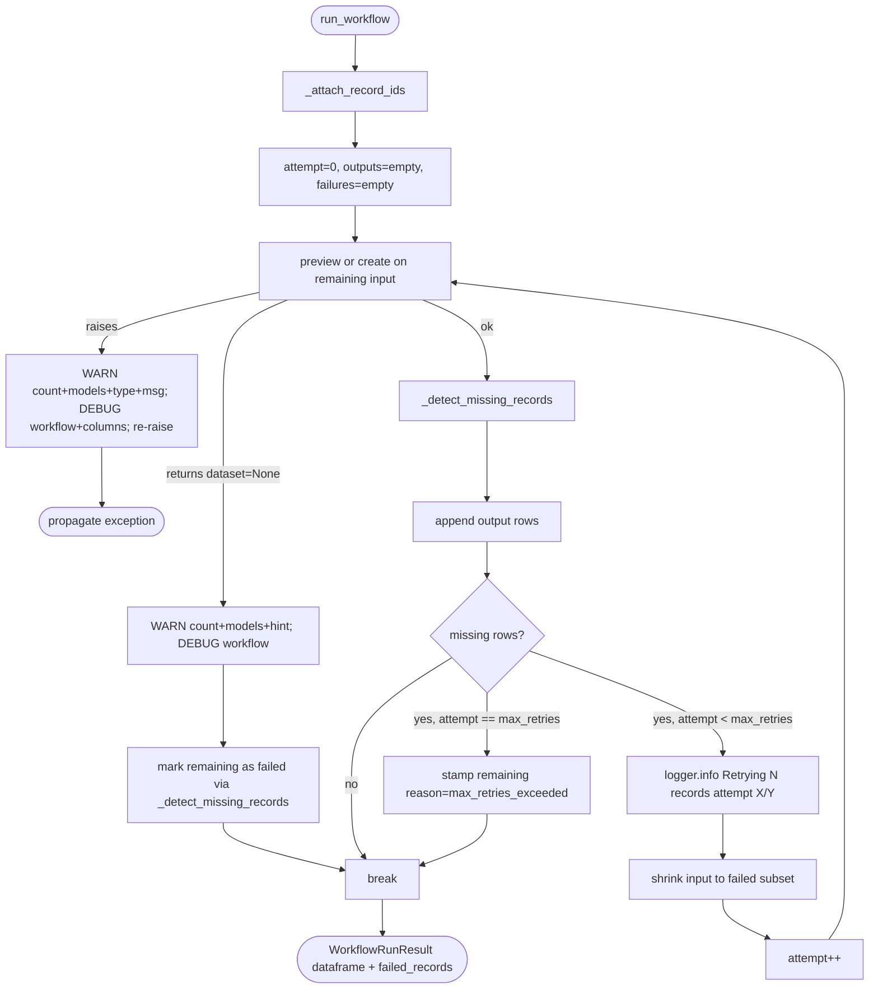

# Implementation Plan: Add Visibility and Retry to Silent Data Designer Failures in `NddAdapter`

## Problem

`NddAdapter` in [src/anonymizer/engine/ndd/adapter.py](src/anonymizer/engine/ndd/adapter.py) wraps every Data Designer call the pipeline makes. Three failure paths are silent today, and a retry mechanism that the existing bookkeeping already enables is missing.

1. **`preview` and `create` exceptions propagate without adapter-level context.** Lines 78-83 (`create` + `load_dataset`) and lines 86-89 (`preview`) are both bare today. A user who hits a dead endpoint, auth error, or rate limit sees a raw DD stack trace with no hint of how many records were being processed or against which model alias.
2. **`preview_results.dataset is None` silently drops all input records.** Lines 90-91 turn it into `workflow_input_df.iloc[0:0].copy()` with no warning. This branch is defensive - today `data_designer.interface.data_designer.preview()` raises `DataDesignerGenerationError` when the processed dataset is empty rather than returning `PreviewResults(dataset=None)`. The branch still needs to be non-silent so that mocks, test doubles, and any future DD behavior change surface loudly.
3. **`_detect_missing_records` returns `[]` silently on input short-circuit.** Lines 131-132 bypass detection when the **input** lacks `RECORD_ID_COLUMN` (defensive - `_attach_record_ids` always adds it today). The **output** short-circuit (lines 133-141) does flag every record as failed but still emits no log line. Both short-circuits should warn.
4. **No retry mechanism** despite `WorkflowRunResult.failed_records` + deterministic `_compute_record_id()` already enabling it. Failed records are tracked, logged, and discarded.

## Scope

In scope:

- Visibility: wrap both `preview` and `create`+`load_dataset` in `try/except` that emits a user-facing WARNING carrying **row count + model aliases + `type(exc).__name__` + message + actionable hint**, plus a parallel DEBUG line with `workflow_name` and column list. Re-raise unchanged.
- Visibility: on `preview_results.dataset is None`, emit a user-facing WARNING carrying **row count + model aliases + actionable hint** (DEBUG for `workflow_name`). The existing downstream `_detect_missing_records` call will populate `failed_records` so drops are reflected in `WorkflowRunResult` too.
- Visibility: in `_detect_missing_records`, emit a user-facing WARNING in **both** short-circuits (input-missing and output-missing) naming the row count; DEBUG line carries `workflow_name` and `RECORD_ID_COLUMN` literal.
- Logging convention: any line a user should read to understand a failure is WARNING with counts/models/error-type baked in; any line that exists to help a developer grep (workflow name, tracking column literal, column list) is DEBUG.
- Retry: bounded retry loop inside `NddAdapter.run_workflow()` that re-submits rows missing from output until they all appear or `max_retries` is exhausted. Final stragglers get `reason="max_retries_exceeded"`.
- `max_retries` exposed as an `NddAdapter.__init__` kwarg (default 2). No CLI / config-file plumbing.
- Unit tests in [tests/engine/test_ndd_adapter.py](tests/engine/test_ndd_adapter.py).

Out of scope:

- Retrying whole-call exceptions (transient network failures): logged and re-raised, no auto-retry.
- User-facing CLI / SDK config for `max_retries`.
- Changes to downstream consumers (`rewrite_workflow`, `replace_runner`, `detection_workflow`). They already aggregate `failed_records` and keep working.

## Files Changed

- [src/anonymizer/engine/ndd/adapter.py](src/anonymizer/engine/ndd/adapter.py) - visibility fixes, `max_retries` kwarg, retry loop.
- [tests/engine/test_ndd_adapter.py](tests/engine/test_ndd_adapter.py) - new tests for each new path.

## Flow After Changes




## Steps

### Step 1 - Visibility (independent, merge-safe)

File: [src/anonymizer/engine/ndd/adapter.py](src/anonymizer/engine/ndd/adapter.py)

**Logging convention for this step.** Every new log line follows the same pattern:

- **WARNING** - self-contained, user-facing. Must carry row count, model aliases (`[m.alias for m in model_configs]`), and (for exceptions) `type(exc).__name__` + message + a short actionable hint. No workflow names, no internal column constants.
- **DEBUG** - developer breadcrumb. Carries `workflow_name`, `RECORD_ID_COLUMN` literal, column list, and any other internal context. One DEBUG line per WARNING site.

1a. Wrap **both** `preview` and `create`+`load_dataset` in `try/except`. No existing pattern to extend - both calls are bare today.

```python
model_aliases = [m.alias for m in model_configs]

if preview_num_records is None:
    try:
        run_results = self._data_designer.create(
            config_builder,
            num_records=len(workflow_input_df),
            dataset_name=workflow_name,
        )
        output_df = run_results.load_dataset()
    except Exception as exc:
        logger.warning(
            "Data Designer create failed for %d input record(s) on model(s) %s: %s: %s. "
            "Check endpoint reachability, credentials, and quota.",
            len(workflow_input_df), model_aliases, type(exc).__name__, exc,
        )
        logger.debug(
            "NDD workflow '%s' create failure context: columns=%s",
            workflow_name, col_names,
        )
        raise
else:
    effective_preview = min(preview_num_records, len(workflow_input_df))
    try:
        preview_results = self._data_designer.preview(
            config_builder,
            num_records=effective_preview,
        )
    except Exception as exc:
        logger.warning(
            "Data Designer preview failed for %d input record(s) on model(s) %s: %s: %s. "
            "Check endpoint reachability, credentials, and quota.",
            effective_preview, model_aliases, type(exc).__name__, exc,
        )
        logger.debug(
            "NDD workflow '%s' preview failure context: columns=%s",
            workflow_name, col_names,
        )
        raise
    ...
```

1b. Replace the silent `None`-dataset branch with a WARNING + DEBUG pair. Drop from the message any mention of future DD versions - we describe the current observable effect and an action:

```python
if preview_results.dataset is None:
    logger.warning(
        "Data Designer preview returned no dataset; %d input record(s) were dropped "
        "(model(s): %s). Check Data Designer preview logs for column-level errors, "
        "verify model/config, or try `create` instead of `preview`.",
        effective_preview, model_aliases,
    )
    logger.debug(
        "NDD workflow '%s' preview dataset=None; emitting empty output", workflow_name,
    )
    output_df = workflow_input_df.iloc[0:0].copy()
```

The downstream `_detect_missing_records` call will then emit a `FailedRecord` per input row, so the drop is visible in `WorkflowRunResult` too.

1c. In `_detect_missing_records`, add a WARNING + DEBUG pair to **both** short-circuits (not only the input case). Each pair also surfaces **why** the tracking column went missing, using the information available at each call site. Counts come from `len(input_df)` since every input row is at risk:

**Output-missing - diagnose via column diff.** The output's missing column is almost always caused by Data Designer not passing the seed column through (disabled pass-through, a user column config named `_anonymizer_record_id`, or a DD version change). We have both schemas in scope, so we log the set difference as an actionable breadcrumb:

```python
if RECORD_ID_COLUMN not in output_df.columns:
    input_cols = set(input_df.columns)
    output_cols = set(output_df.columns)
    other_dropped = sorted((input_cols - output_cols) - {RECORD_ID_COLUMN})
    added = sorted(output_cols - input_cols)
    logger.warning(
        "Missing-record detection disabled: Data Designer output does not contain "
        "the record-tracking column, so all %d input record(s) are being marked as "
        "failed. This typically means seed-column pass-through is disabled or a "
        "user-supplied column config overwrote it. Other input columns that were "
        "also dropped: %s. Columns added by Data Designer: %s.",
        len(input_df), other_dropped, added,
    )
    logger.debug(
        "NDD workflow '%s' detection disabled: output missing '%s'; "
        "input_columns=%s output_columns=%s",
        workflow_name, RECORD_ID_COLUMN,
        list(input_df.columns), list(output_df.columns),
    )
    return [
        FailedRecord(
            record_id=record_id,
            step=workflow_name,
            reason=f"Output is missing required tracking column '{RECORD_ID_COLUMN}'",
        )
        for record_id in input_df[RECORD_ID_COLUMN].astype(str).tolist()
    ]
```

**Input-missing - diagnose as internal invariant violation.** Under normal `run_workflow` control flow this branch is unreachable because `_attach_record_ids` unconditionally adds the column; reaching it means a direct caller bypassed that helper or a future refactor broke the invariant (it is not a Data Designer symptom). The WARNING says so; the DEBUG dumps the input columns to help identify the caller:

```python
if RECORD_ID_COLUMN not in input_df.columns:
    logger.warning(
        "Missing-record detection skipped: input DataFrame lacks the record-tracking "
        "column, so the adapter cannot verify whether any of %d input record(s) were "
        "dropped. This indicates an internal invariant violation - `_attach_record_ids` "
        "was not called on this DataFrame before detection.",
        len(input_df),
    )
    logger.debug(
        "NDD workflow '%s' detection skipped: input missing '%s'; input_columns=%s",
        workflow_name, RECORD_ID_COLUMN, list(input_df.columns),
    )
    return []
```

### Step 2 - Retry loop

File: [src/anonymizer/engine/ndd/adapter.py](src/anonymizer/engine/ndd/adapter.py)

2a. Extend `NddAdapter.__init__` with `max_retries: int = 2` kwarg, stored as `self._max_retries`.

2b. Refactor the body of `run_workflow` after the `tempfile.TemporaryDirectory` opens into a loop. Each iteration:

- Build a fresh `config_builder` + `LocalFileSeedSource` from the current `remaining_input_df` (full input on attempt 0, failed subset thereafter). The seed parquet can be rewritten in the same temp dir using an attempt-scoped filename (`seed_{attempt}.parquet`) so attempts don't clobber each other.
- Invoke `preview` or `create` through the Step-1 `try/except` helpers.
- On `dataset is None` (preview only): warn, stamp remaining rows as failed, break.
- Otherwise, run `_detect_missing_records` against the attempt's input vs the attempt's output, append successful rows into `collected_output_df`.
- If failed rows remain and `attempt < self._max_retries`, log `"Retrying %d failed records (attempt %d/%d)"` and continue with `remaining_input_df = workflow_input_df[workflow_input_df[RECORD_ID_COLUMN].isin(failed_ids)]`.
- If failed rows remain and `attempt == self._max_retries`, rewrite their `FailedRecord.reason` to `"max_retries_exceeded"` and break.

2c. Return `WorkflowRunResult(dataframe=collected_output_df, failed_records=final_failures)`.

### Step 3 - Tests

File: [tests/engine/test_ndd_adapter.py](tests/engine/test_ndd_adapter.py) (existing tests stay; additions below use the same `Mock(spec=DataDesigner)` pattern).

Visibility tests (Step 1). Each test captures logs with `caplog.set_level(logging.DEBUG, logger="anonymizer.ndd")` so WARNING and DEBUG assertions can be made in the same test.

- `test_preview_exception_warns_with_count_model_and_type_and_debug_carries_workflow`: mock `preview` to raise `class MyErr(Exception)`; assert `pytest.raises(MyErr)` AND the WARNING record contains the input count, the `alias` of the supplied `ModelConfig`, and `"MyErr"`, AND a DEBUG record contains the `workflow_name`. Explicitly assert the WARNING does **not** mention `workflow_name` (that stays DEBUG-only).
- `test_create_exception_warns_with_count_model_and_type_and_debug_carries_workflow`: same assertions with `run_workflow(preview_num_records=None)` and a `create` mock that raises.
- `test_preview_none_dataset_warns_with_count_and_populates_failed_records`: mock `preview` to return `PreviewResults(dataset=None, ...)`; assert `len(result.dataframe) == 0`, `len(result.failed_records) == 3`, the WARNING mentions `"3"` and the model alias, and a DEBUG record carries the `workflow_name`.
- `test_detect_missing_records_short_circuit_warns_when_input_missing_id`: call `_detect_missing_records` directly with a 3-row `input_df` lacking `RECORD_ID_COLUMN` (columns `["text", "label"]`); assert returns `[]`, WARNING contains `"3"`, `"detection skipped"`, and `"invariant violation"`, DEBUG contains `workflow_name`, the `RECORD_ID_COLUMN` literal, and the actual input column names (so a failing caller is identifiable).
- `test_detect_missing_records_short_circuit_warns_when_output_missing_id`: call `_detect_missing_records` with 3-row `input_df` whose columns are `[RECORD_ID_COLUMN, "text", "label"]` and `output_df` whose columns are `["text", "rewrite"]` (tracking column and `"label"` both dropped, `"rewrite"` added); assert all 3 rows are returned as `FailedRecord`s with the existing tracking-column reason. Assert WARNING contains `"3"` and `"detection disabled"`, lists `"label"` among "other dropped" and `"rewrite"` among "added", and does **not** contain the `RECORD_ID_COLUMN` literal (`_anonymizer_record_id`) anywhere in its formatted message. Assert DEBUG contains `workflow_name`, the `RECORD_ID_COLUMN` literal, and the full input/output column lists.

Retry tests (Step 2):

- `test_retry_succeeds_on_second_attempt`: mock `preview` so first call drops rows `1,2` of 3, second call returns `1,2`; assert final `dataframe` has all 3 rows in stable order (e.g. by `RECORD_ID_COLUMN`), `failed_records == []`, and `caplog` contains `"Retrying 2 failed records (attempt 1/2)"`.
- `test_retry_exhausts_and_marks_max_retries_exceeded`: mock `preview` to drop the same rows on every attempt; assert surviving failures carry `reason="max_retries_exceeded"` and the retry log appears `max_retries` times.
- `test_max_retries_zero_disables_retry`: instantiate `NddAdapter(data_designer=..., max_retries=0)`; with first-call drops, assert `preview` is called exactly once, the retry log never fires, and failed records use the normal `"Record missing from workflow output"` reason.
- `test_clean_first_attempt_skips_retry`: mock `preview` to return a full output on first call; assert `preview` is called exactly once and no retry log appears.

## Implementation Order

1. Step 1 (visibility) + its four tests. Small, independent, passes linting + tests on its own.
2. Step 2 (retry) + its four tests. Builds on Step 1's logging helpers but does not depend on them semantically.

Each step is a standalone green-tests checkpoint; no behavioral coupling between them.

## Commits

1. `fix(ndd): surface silent preview/create failures in adapter logs`
  - Wrap `preview` and `create`+`load_dataset` in `try/except` that logs a user-facing WARNING (row count, model aliases, `type(exc).__name__`, message, actionable hint) plus a DEBUG breadcrumb (`workflow_name`, column list); then re-raise unchanged.
  - Warn on `preview_results.dataset is None` (WARNING: count + model aliases + hint; DEBUG: workflow name). Downstream `_detect_missing_records` still populates `failed_records`.
  - Warn in `_detect_missing_records` for both short-circuits - input missing and output missing `RECORD_ID_COLUMN` (WARNING: count + plain-English reason; DEBUG: workflow name + tracking-column literal).
  - Tests: `test_preview_exception_warns_with_count_model_and_type_and_debug_carries_workflow`, `test_create_exception_warns_with_count_model_and_type_and_debug_carries_workflow`, `test_preview_none_dataset_warns_with_count_and_populates_failed_records`, `test_detect_missing_records_short_circuit_warns_when_input_missing_id`, `test_detect_missing_records_short_circuit_warns_when_output_missing_id`.
2. `feat(ndd): retry records missing from output up to max_retries times`
  - Add `max_retries` kwarg (default 2) to `NddAdapter.__init_`_.
  - Retry loop in `run_workflow` with failed-subset re-submission, merged outputs, `"max_retries_exceeded"` stamp.
  - Tests: `test_retry_succeeds_on_second_attempt`, `test_retry_exhausts_and_marks_max_retries_exceeded`, `test_max_retries_zero_disables_retry`, `test_clean_first_attempt_skips_retry`.

