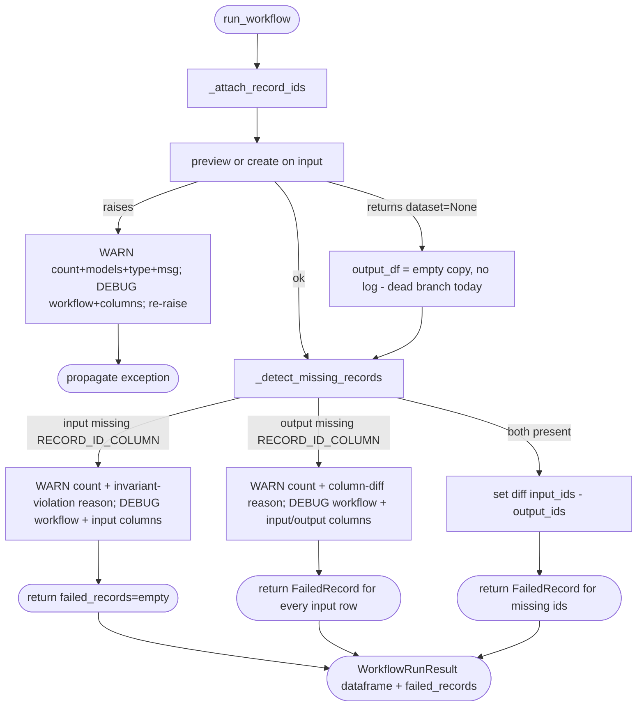

# Add Visibility to Silent Failures in `NddAdapter`- Implementation Plan

## Problem

`NddAdapter` in [src/anonymizer/engine/ndd/adapter.py](src/anonymizer/engine/ndd/adapter.py) wraps every underlying workflow call the pipeline makes. Today the adapter has two classes of log gaps when things go wrong - one that is genuinely silent and one that is already surfaced upstream but hard to investigate locally:

1. **`preview` and `create` exceptions propagate without adapter-level context.** Lines 78-83 (`create` + `load_dataset`) and lines 86-89 (`preview`) are both bare today. A user who hits a dead endpoint, auth error, or rate limit sees a raw stack trace with no hint of how many records were being processed or against which model alias.
2. **`_detect_missing_records` short-circuits need different treatment.** The two branches are not equivalent:
   - **Input-missing (lines 131-132) is a correctness-facing silent drop.** When the **input** lacks `RECORD_ID_COLUMN`, detection returns `[]` - so zero `FailedRecord`s surface upstream even though the adapter can no longer verify whether any rows were dropped. This is a genuinely silent state that warrants a WARNING. It is defensive today (`_attach_record_ids` always adds the column under normal `run_workflow` control flow), so reaching it signals an internal invariant violation.
   - **Output-missing (lines 133-141) is an observability gap, not a correctness bug.** When the **output** lacks `RECORD_ID_COLUMN`, the adapter already flags every input row as a `FailedRecord`, and upstream anonymizer logging already surfaces aggregate failures - so downstream callers are not blind to the problem. What is missing today is a local breadcrumb at the point of detection explaining **why** every row was marked failed (column pass-through dropped, user column config clash, etc.), which would shave investigation time. Adding a WARNING there is a diagnostic improvement.

## Scope

This PR is strictly a log-visibility pass. No behavior changes, no retry mechanism, no exception-type changes.

In scope:

- Visibility: wrap both `preview` and `create`+`load_dataset` in `try/except` that emits a user-facing WARNING carrying **row count + model aliases + `type(exc).__name__` + message + actionable hint**, plus a parallel DEBUG line with `workflow_name` and column list. Re-raise unchanged.
- Visibility: in `_detect_missing_records`, emit a user-facing WARNING in both short-circuits naming the row count, but with deliberately different framing:
  - Input-missing: framed as a correctness-facing silent drop and an internal invariant violation (new information that is not surfaced today).
  - Output-missing: framed as an observability/diagnostic improvement that complements the existing upstream aggregate logging, not a correctness fix; the WARNING adds local "why every row was marked failed" context (column diff) at the point of detection.

  DEBUG line in either case carries `workflow_name` and `RECORD_ID_COLUMN` literal.
- Logging convention: any line a user should read to understand a failure is WARNING with counts/models/error-type baked in; any line that exists to help a developer grep (workflow name, tracking column literal, column list) is DEBUG.
- **No references to the underlying workflow backend in any log message we add** (WARNING or DEBUG). Users should not have to know or care which library the adapter is built on. This rule applies only to the new log lines introduced in this PR; pre-existing log strings in the file are left untouched.
- Unit tests in [tests/engine/test_ndd_adapter.py](tests/engine/test_ndd_adapter.py) covering each new log path.

Out of scope:

- Retry loop over `failed_records`. The tracking plumbing still makes retries possible later, but adding that policy to a shared adapter is premature; the right fix is root-cause diagnostics, which belong in a separate change. For now, full debug logging is the supported way to investigate failures.
- Any logging on the `preview_results.dataset is None` branch. Under the current backend contract that branch is effectively dead code (the library raises before returning `None`), so adding a log there would describe behavior that does not actually occur and would be misleading. Leave the existing `output_df = workflow_input_df.iloc[0:0].copy()` fallback as-is for type-checker compliance and defense in depth, with no log line.
- Replacing propagated errors with anonymizer-specific exception types. That cleanup is a separate change; this PR only logs and re-raises.
- Retrying whole-call exceptions (transient network failures): logged and re-raised, no auto-retry.
- Changes to downstream consumers (`rewrite_workflow`, `replace_runner`, `detection_workflow`). They already aggregate `failed_records` and keep working.

## Files Changed

- [src/anonymizer/engine/ndd/adapter.py](src/anonymizer/engine/ndd/adapter.py) - visibility fixes only.
- [tests/engine/test_ndd_adapter.py](tests/engine/test_ndd_adapter.py) - new tests for each new log path.

## Flow After Changes



## Steps

### Step 1 - Visibility (the entire PR)

File: [src/anonymizer/engine/ndd/adapter.py](src/anonymizer/engine/ndd/adapter.py)

**Logging convention for this step.** Every new log line follows the same pattern:

- **WARNING** - self-contained, user-facing. Must carry row count, model aliases (`[m.alias for m in model_configs]`), and (for exceptions) `type(exc).__name__` + message + a short actionable hint. No workflow names, no internal column constants, **no references to the backend library**.
- **DEBUG** - developer breadcrumb. Carries `workflow_name`, `RECORD_ID_COLUMN` literal, column list, and any other internal context. One DEBUG line per WARNING site. Also no references to the backend library.

1a. Wrap **both** `preview` and `create`+`load_dataset` in `try/except`. No existing pattern to extend - both calls are bare today.

```python
model_aliases = [m.alias for m in model_configs]

if preview_num_records is None:
    try:
        run_results = self._data_designer.create(
            config_builder,
            num_records=len(workflow_input_df),
            dataset_name=workflow_name,
        )
        output_df = run_results.load_dataset()
    except Exception as exc:
        logger.warning(
            "Workflow execution failed for %d input record(s) on model(s) %s: %s: %s. "
            "Check endpoint reachability, credentials, and quota.",
            len(workflow_input_df), model_aliases, type(exc).__name__, exc,
        )
        logger.debug(
            "Workflow '%s' execution failure context: columns=%s",
            workflow_name, col_names,
        )
        raise
else:
    effective_preview = min(preview_num_records, len(workflow_input_df))
    try:
        preview_results = self._data_designer.preview(
            config_builder,
            num_records=effective_preview,
        )
    except Exception as exc:
        logger.warning(
            "Workflow preview failed for %d input record(s) on model(s) %s: %s: %s. "
            "Check endpoint reachability, credentials, and quota.",
            effective_preview, model_aliases, type(exc).__name__, exc,
        )
        logger.debug(
            "Workflow '%s' preview failure context: columns=%s",
            workflow_name, col_names,
        )
        raise
    ...
```

The `preview_results.dataset is None` branch is **not** logged (see "Out of scope"): the existing `output_df = workflow_input_df.iloc[0:0].copy()` fallback stays unchanged.

1b. In `_detect_missing_records`, add a WARNING + DEBUG pair to **both** short-circuits, but with deliberately different framing (see Problem #2). Counts come from `len(input_df)` since every input row is at risk.

**Output-missing - observability improvement, framed as a diagnostic breadcrumb.** This branch is **not fully silent today**: the adapter already returns a `FailedRecord` for every input row and upstream anonymizer logging already aggregates failures, so downstream callers are not blind. What is missing is a local explanation of **why** every row was just marked failed. The WARNING fills that gap without implying we are fixing a correctness bug. The output's missing column is almost always caused by the workflow dropping or overwriting the seed column (disabled pass-through, a user column config named `_anonymizer_record_id`, or a backend version change); we log the set difference as the actionable breadcrumb, phrased entirely in anonymizer-level terms:

```python
if RECORD_ID_COLUMN not in output_df.columns:
    input_cols = set(input_df.columns)
    output_cols = set(output_df.columns)
    other_dropped = sorted((input_cols - output_cols) - {RECORD_ID_COLUMN})
    added = sorted(output_cols - input_cols)
    logger.warning(
        "Missing-record detection disabled: workflow output does not contain "
        "the record-tracking column, so all %d input record(s) are being marked as "
        "failed. This typically means seed-column pass-through is disabled or a "
        "user-supplied column config overwrote it. Other input columns that were "
        "also dropped: %s. Columns added by the workflow: %s.",
        len(input_df), other_dropped, added,
    )
    logger.debug(
        "Workflow '%s' detection disabled: output missing '%s'; "
        "input_columns=%s output_columns=%s",
        workflow_name, RECORD_ID_COLUMN,
        list(input_df.columns), list(output_df.columns),
    )
    return [
        FailedRecord(
            record_id=record_id,
            step=workflow_name,
            reason=f"Output is missing required tracking column '{RECORD_ID_COLUMN}'",
        )
        for record_id in input_df[RECORD_ID_COLUMN].astype(str).tolist()
    ]
```

**Input-missing - correctness-facing silent drop, framed as an internal invariant violation.** This branch is the silent-drop case: it returns `[]` so **no** `FailedRecord`s ever reach upstream aggregation, and the adapter cannot verify whether rows were dropped. Under normal `run_workflow` control flow it is unreachable because `_attach_record_ids` unconditionally adds the column; reaching it means a direct caller bypassed that helper or a future refactor broke the invariant. The WARNING says so; the DEBUG dumps the input columns to help identify the caller:

```python
if RECORD_ID_COLUMN not in input_df.columns:
    logger.warning(
        "Missing-record detection skipped: input DataFrame lacks the record-tracking "
        "column, so the adapter cannot verify whether any of %d input record(s) were "
        "dropped. This indicates an internal invariant violation - `_attach_record_ids` "
        "was not called on this DataFrame before detection.",
        len(input_df),
    )
    logger.debug(
        "Workflow '%s' detection skipped: input missing '%s'; input_columns=%s",
        workflow_name, RECORD_ID_COLUMN, list(input_df.columns),
    )
    return []
```

### Step 2 - Tests

File: [tests/engine/test_ndd_adapter.py](tests/engine/test_ndd_adapter.py) (existing tests stay; additions below use the same `Mock(spec=DataDesigner)` pattern).

Each test captures logs with `caplog.set_level(logging.DEBUG, logger="anonymizer.ndd")` so WARNING and DEBUG assertions can be made in the same test. For each **newly added** WARNING/DEBUG record, the test also asserts the record's formatted message does **not** contain any of `"Data Designer"`, `"data_designer"`, or `"DD"` - this guards the "no backend references in the new log lines" rule. Pre-existing log records are ignored by this assertion (they are out of scope for this PR).

- `test_preview_exception_warns_with_count_model_and_type_and_debug_carries_workflow`: mock `preview` to raise `class MyErr(Exception)`; assert `pytest.raises(MyErr)` AND the WARNING record contains the input count, the `alias` of the supplied `ModelConfig`, and `"MyErr"`, AND a DEBUG record contains the `workflow_name`. Explicitly assert the WARNING does **not** mention `workflow_name` (that stays DEBUG-only) and does not reference the backend.
- `test_create_exception_warns_with_count_model_and_type_and_debug_carries_workflow`: same assertions with `run_workflow(preview_num_records=None)` and a `create` mock that raises.
- `test_detect_missing_records_short_circuit_warns_when_input_missing_id`: call `_detect_missing_records` directly with a 3-row `input_df` lacking `RECORD_ID_COLUMN` (columns `["text", "label"]`); assert returns `[]`, WARNING contains `"3"`, `"detection skipped"`, and `"invariant violation"`, DEBUG contains `workflow_name`, the `RECORD_ID_COLUMN` literal, and the actual input column names (so a failing caller is identifiable).
- `test_detect_missing_records_short_circuit_warns_when_output_missing_id`: call `_detect_missing_records` with 3-row `input_df` whose columns are `[RECORD_ID_COLUMN, "text", "label"]` and `output_df` whose columns are `["text", "rewrite"]` (tracking column and `"label"` both dropped, `"rewrite"` added); assert all 3 rows are returned as `FailedRecord`s with the existing tracking-column reason. Assert WARNING contains `"3"` and `"detection disabled"`, lists `"label"` among "other dropped" and `"rewrite"` among "added", and does **not** contain the `RECORD_ID_COLUMN` literal (`_anonymizer_record_id`) anywhere in its formatted message. Assert DEBUG contains `workflow_name`, the `RECORD_ID_COLUMN` literal, and the full input/output column lists.

No test is added for `preview_results.dataset is None` (log-less dead branch).

## Implementation Order

Single step: Step 1 (visibility) + its four tests. Small, self-contained, passes linting + tests on its own.

## Commits

1. `fix(ndd): surface silent preview/create failures and detection short-circuits in adapter logs`
  - Wrap `preview` and `create`+`load_dataset` in `try/except` that logs a user-facing WARNING (row count, model aliases, `type(exc).__name__`, message, actionable hint) plus a DEBUG breadcrumb (`workflow_name`, column list); then re-raise unchanged.
  - Warn in `_detect_missing_records` for both short-circuits, with distinct framing: input-missing as a correctness-facing silent-drop / invariant violation, output-missing as an observability improvement that complements existing upstream aggregate logging (WARNING: count + plain-English reason; DEBUG: workflow name + tracking-column literal + column lists).
  - Tests: `test_preview_exception_warns_with_count_model_and_type_and_debug_carries_workflow`, `test_create_exception_warns_with_count_model_and_type_and_debug_carries_workflow`, `test_detect_missing_records_short_circuit_warns_when_input_missing_id`, `test_detect_missing_records_short_circuit_warns_when_output_missing_id`.
