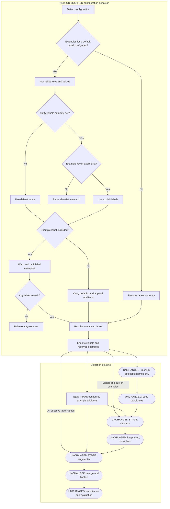
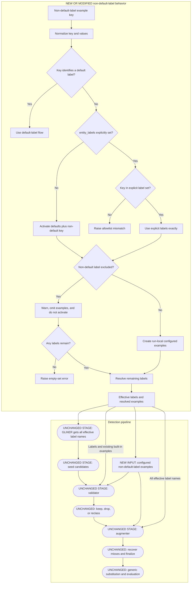
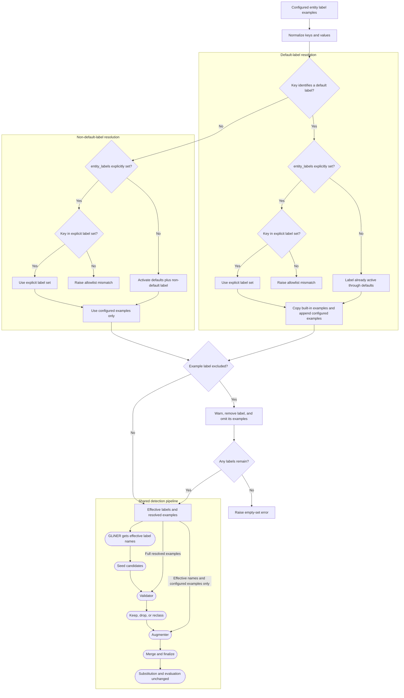

# Entity Label Examples

## Goal and boundaries

- Add `Detect.entity_label_examples: dict[str, list[str]]` as per-run positive detection guidance.
- Pass the full resolved example ontology to the validator and only user-configured examples to the augmenter. Do not change substitution, evaluation, or `AnonymizerResult`/`PreviewResult`.
  - Example: a detected non-default `vendor_api_key` is still substituted using the existing generic non-default-label fallback; its configured detection examples do not guide replacement generation.
  - Evaluation example: suppose detection uses `{"vendor_api_key": ["acme_live_abc123"]}`, finds `acme_live_xyz789`, and `Substitute()` produces `acme_live_qrs456`. Existing evaluation may report `entity_coverage=1.0` when the original value is covered, `detection_valid=True` when the optional detection judge accepts the value/label from context, and `type_fidelity_valid=True` when the synthetic value preserves a plausible class and structure. These outcomes are model-dependent, and none of these judges receive `acme_live_abc123`; a non-default label falls back to generic/contextual judgment rather than configured-example comparison.
- Examples improve model interpretation but are not format allowlists or guaranteed exclusions.

## Terminology

- **Explicit label set:** labels supplied through `entity_labels`; it may include default and non-default labels.
- **Default label:** a label present in `DEFAULT_ENTITY_LABELS`.
- **Non-default label:** a label absent from `DEFAULT_ENTITY_LABELS`.
- **Built-in examples:** examples shipped with Anonymizer in `ENTITY_LABEL_EXAMPLES`.
- **Configured examples:** user-supplied positive examples in `entity_label_examples`; they may target default or non-default labels.

## Intentional divergences and known limitations

- Document two intentional differences from issue #259:
  - configured example keys for non-default labels automatically activate those labels alongside defaults when `entity_labels=None`;
  - the augmenter receives only configured examples rather than the full resolved mapping of built-in and configured examples.
- Keep evaluation out of scope and record the consequence: configured examples are not persisted on `AnonymizerResult`/`PreviewResult`, and automatically activated non-default labels are not reproduced as an explicit evaluation allowlist. Entity coverage remains permissive when the originating `entity_labels` was `None` and does not receive the configured examples.
- Treat example values as potentially sensitive configuration. They are embedded in validator/augmenter prompts, included in exported detection builders, and sent to configured model providers.
  - Example: use synthetic `acme_live_abc123`, never a real production credential or customer identifier.
- Do not include example values in telemetry, logs, warning text, or measurement attributes.

## Examples for default labels

### Behavior

- When a configured example key identifies a default label, keep the label’s built-in examples and append the configured examples.
  - Example: `{"api_key": ["sk-ant-api03-abc123"]}` retains built-in examples such as `sk-abc123def456`.
- Stable-deduplicate the merged list without mutating `[ENTITY_LABEL_EXAMPLES](src/anonymizer/engine/constants.py)`.
- Configured examples for a default label are valid with `entity_labels=None` because that label is already active through defaults.
- If `entity_labels` is explicit, require the default-label example key to be present in that explicit label set.
  - Example: `entity_labels=["email"]` with examples for `api_key` is an error.
- Let `excluded_entity_labels` take precedence: warn and ignore examples for an excluded default label; error only when no effective labels remain.
  - Example: excluded `api_key` examples are omitted while other defaults remain active. If `api_key` is the only explicit label, exclusion leaves an empty set and raises.

### Resolution example

```python
Detect(
    entity_label_examples={
        "api_key": ["sk-ant-api03-abc123"],
    },
)
```

Resolves to the default label set and a run-local `api_key` example list containing built-in examples followed by `sk-ant-api03-abc123`.

### Default-label example flow



- Diagram key: rectangles and decision diamonds are new or modified behavior; rounded nodes are unchanged stages from `main`.
- Without `entity_label_examples`, label resolution and prompt behavior remain unchanged.
- With configured examples for default labels, GLiNER still receives only active label names. The validator receives built-in examples plus configured examples, while the augmenter receives only configured examples.
- An explicit `entity_labels` set remains authoritative: a configured default-label example key outside that set is an error.
- Exclusions remove the label and its examples. Processing continues with a warning when labels remain and fails only when the effective set becomes empty.

## Examples for non-default labels

### Behavior

- When a configured example key identifies a non-default label and `entity_labels=None`, automatically activate it alongside all defaults.
  - Example: `{"vendor_api_key": ["acme_live_abc123"]}` resolves to `[*DEFAULT_ENTITY_LABELS, "vendor_api_key"]`.
- This intentionally differs from issue #259, which says examples should not activate labels. The divergence avoids requiring users to inspect, import, and unpack `DEFAULT_ENTITY_LABELS` for the common defaults-plus-non-default case.
- When `entity_labels` is explicit, keep it strict: every non-default-label example key must already be listed.
  - Example: `entity_labels=["vendor_api_key"]` with matching examples detects only that non-default label.
  - Example: `entity_labels=["email"]` with examples for `vendor_api_key` is an error.
- Let exclusions take precedence under automatic and explicit activation. Warn, omit the configured examples, and do not auto-activate an excluded non-default label; error only if all effective default and non-default labels are excluded.
  - Example: excluded `vendor_api_key` is ignored while defaults continue; `entity_labels=["vendor_api_key"]` plus the same exclusion is an empty-set error.
- Treat unknown normalized keys as intentional non-default labels when `entity_labels=None`; spelling intent cannot be inferred.
  - Example: `vendor_api_ky` is activated as written. With explicit `entity_labels=["vendor_api_key"]`, the mismatch is caught.
- Preserve existing augmenter strictness: automatic defaults-plus-non-default mode remains permissive; an explicit label set remains strict.

### Resolution examples

Defaults plus a non-default label:

```python
Detect(
    entity_label_examples={
        "vendor_api_key": ["acme_live_abc123"],
    },
)
```

Non-default only:

```python
Detect(
    entity_labels=["vendor_api_key"],
    entity_label_examples={
        "vendor_api_key": ["acme_live_abc123"],
    },
)
```

### Non-default-label example flow



- Diagram key: rectangles and decision diamonds are new or modified behavior; rounded nodes are unchanged stages from `main`.
- With `entity_labels=None`, a normalized non-default key is intentionally treated as defaults-plus-non-default activation. This is a documented usability divergence from issue #259.
- With explicit `entity_labels`, the set remains strict. It can select non-default-only detection or defaults plus non-default labels, but every example key must already be listed.
- A misspelled unknown key is treated as an intentional non-default label in automatic mode; an explicit label set can catch a mismatch.
- Default and non-default labels use the same detection sequence. GLiNER-found candidates receive validator review; the augmenter then searches for misses using all active label names and only user-configured examples.
- Augmented findings are not independently revalidated. If validator cost later justifies augmenter-only non-default labels, that should be a separate feature with explicit scopes and documented quality tradeoffs.

## Combined alternative flow

This diagram combines the default-label and non-default-label resolution branches before they enter the shared detection pipeline. It is an alternative to the two separate diagrams above; those diagrams remain available for a more detailed view of each case.



## Validation shared by both cases

- Extend `[src/anonymizer/config/anonymizer_config.py](src/anonymizer/config/anonymizer_config.py)` with an isolated `default_factory=dict`.
- Normalize keys with `strip().lower()`, trim values without changing case, and copy nested input state.
- Reject blank/non-string keys, empty or non-list collections, and blank/non-string examples.
- Merge normalized duplicate keys in input order and stable-deduplicate their values, emitting a warning.
  - Example: `{" Email ": ["alice@example.test"], "email": ["bob@example.test"]}` becomes one ordered `email` list.
- Compute the effective label set after automatic activation and exclusions, and reject only when that final set is empty.
  - Example: excluding every default remains valid when a non-excluded non-default key is automatically activated; excluding that non-default label too raises.
- Ensure separate configs, caller-owned lists, and sequential runs cannot contaminate one another.

## Shared detection pipeline

- Add a pure run-local resolver near `[src/anonymizer/engine/detection/detection_workflow.py](src/anonymizer/engine/detection/detection_workflow.py)` that resolves effective labels and examples once without modifying module defaults.
- Thread the resolved state through `[src/anonymizer/interface/anonymizer.py](src/anonymizer/interface/anonymizer.py)` for normal runs, previews, rewrite-mode detection, dataframe exports, and seed-builder exports.
- Use the same pipeline for default and non-default labels:
  - GLiNER receives effective label names only; it has no per-label examples input.
  - Validator receives every effective label with its full resolved examples: built-in examples plus configured examples for default labels, and configured examples for non-default labels.
  - Augmenter receives every effective label name as it does today, plus examples only for labels explicitly present in `entity_label_examples`.

## Prompt construction and growth

- Update `_format_label_examples()` and `_get_validation_prompt()` to consume the full resolved mapping. Update `_get_augment_prompt()` separately to receive only normalized user-configured examples, filtered to effective active labels.
- Encode configured values safely as prompt data so punctuation and template-like strings cannot alter rendering.
- Add no runtime size limits in this phase. Document that the full ontology repeats per validator chunk, while only the smaller configured-example block is added once per augmenter row.
  - Example: prefer two representative synthetic vendor-key formats over dozens of real credentials.
- Keep all active labels/examples in validator prompts because candidate-only examples weaken reclassification into labels absent from a chunk.
- Add non-blocking prompt-size regression measurements to inform future limits or retrieval-based designs.

## Tests

- In `[tests/config/test_anonymizer_config.py](tests/config/test_anonymizer_config.py)`, cover shared normalization/isolation plus built-in-example merging, automatic non-default-label activation, explicit non-default-only and mismatch cases, typo behavior, excluded-example warnings, remaining-label continuation, empty effective sets, and serialization.
- In `[tests/engine/test_detection_workflow.py](tests/engine/test_detection_workflow.py)`, separately cover:
  - configured examples merging with built-in examples without global mutation;
  - non-default names reaching GLiNER, full resolved examples reaching validator, and configured-only examples reaching augmenter;
  - built-in examples remaining absent from the augmenter unless the user supplied configured examples for that label;
  - validator keep/drop/reclass and augmenter recovery;
  - effective-label filtering, strict/permissive behavior, safe special characters, and cross-run isolation.
- In `[tests/engine/test_detection_config_serialization.py](tests/engine/test_detection_config_serialization.py)` and interface tests, verify parity across run, preview, rewrite detection, dataframe export, seed export, and round-trip reconstruction.
- Add regressions proving replacement prompts/outputs, evaluation judges, and result dataclasses receive no example state.
- Add telemetry/logging regressions proving configured example values are never emitted, while exported detection builders intentionally contain the prompt examples required for remote execution.

## Documentation and agent skill

- Update `[docs/concepts/detection.md](docs/concepts/detection.md)`, `[docs/concepts/choosing-a-strategy.md](docs/concepts/choosing-a-strategy.md)`, and `[docs/troubleshooting.md](docs/troubleshooting.md)` with separate examples for default labels, defaults plus non-default labels, and explicit non-default-only detection.
- Document positive-only semantics, exclusion precedence and warnings, empty-set errors, typo activation, prompt cost, synthetic-data guidance, and deterministic alternatives for guaranteed negatives.
- Explicitly explain both intentional issue #259 divergences, their user-experience/prompt-size rationale, and the evaluation reproducibility limitation.
- Warn that exported builders and provider requests contain configured examples, and recommend synthetic values rather than real secrets or PII.
- Update `[skills/anonymizer/SKILL.md](skills/anonymizer/SKILL.md)` and its `Detect(...)` template to use automatic defaults-plus-non-default behavior unless the user requests strict non-default-only detection.

